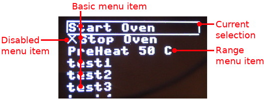
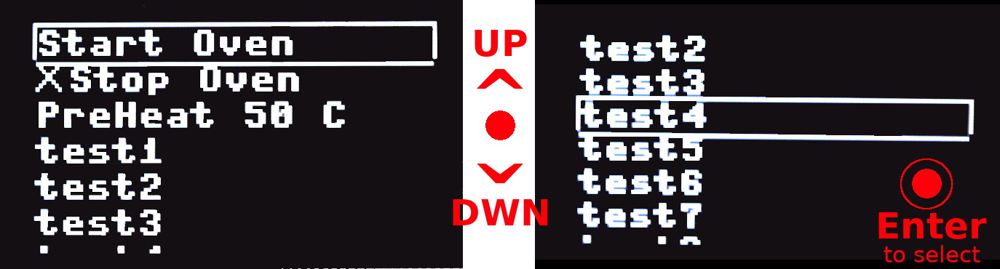
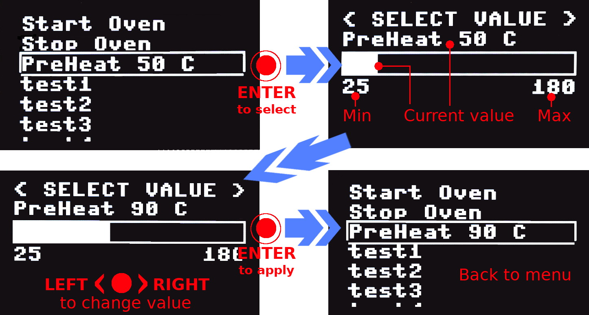
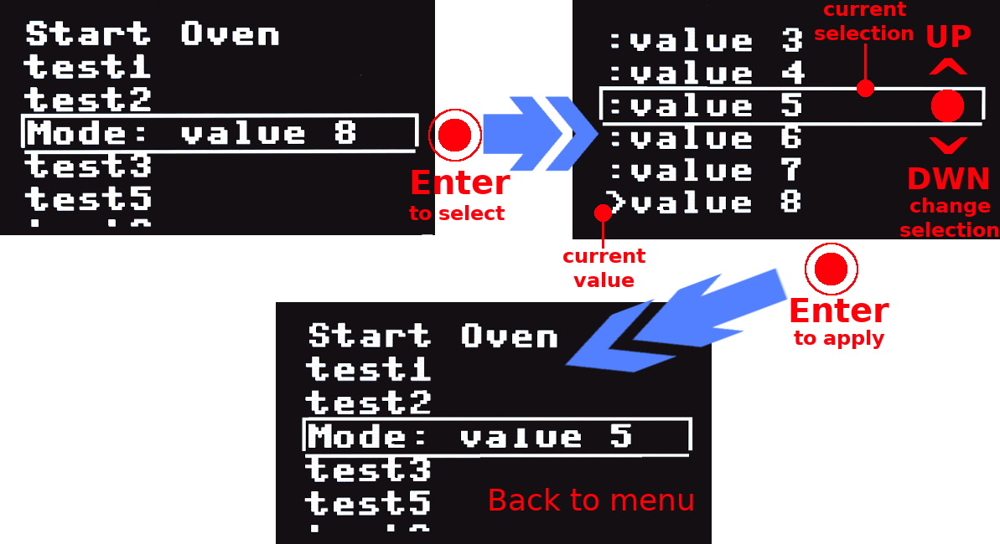

# MenuBoot library

The [menuboot.py](lib/menuboot.py) file contains the __MenuBoot__ class used to draw, manage and detect selected menu entry with the OLED screen.

MenuBoot allows to:

* draw __basic MenuItem__ with code-label (that can be enabled/disabled)
* draw __range MenuItem__ (to select a numeric value within a range)
* draw __combo MenuItem__ (to select a value from a pre-defined key-value list)
* draw __custom MenuItem__ (used to customise action on menuitem)

The __basic MenuItem__ relies on the user code to implement the expected action whereas the __range, combo, custom MenuItem__ are completely autonomous actions not requiring any user code for them to work properly (notice that custom MenuItem allows to bind customized functions to MenuItem).


## MenuBoot class

A menu is constructed with the `MenuBoot` class. The code here below shows how to create the menu entries. The key methods are: `add_label()` , `start()` and `update()`. The menu item selected can be read with the `selected` property.





The following code snipped show how to:

1. create a menu, 
2. display it (use UP and DOWN to move the selection) 
3. get informed when an entry is selected with ENTER.

See the [test_menu_basic.py](examples/test_menu_basic.py) for more details.

``` 
from oledboot import *
from menuboot import *

lcd = OledBoot()
menu = MenuBoot( lcd )

menu.add_label( "start", "Start Oven" ) # code, Label
menu.add_label( "stop" , "Stop Oven" , enabled=False )
menu.add_range( "preheat" , "PreHeat %s C", 25, 180, 5, 50 ) # Min, Max, Step, default
menu.add_label( "t1", "test1" ) 
menu.add_label( "t2", "test2" ) 
menu.add_label( "t3", "test3" ) 
menu.add_label( "t4", "test4" ) 
menu.add_label( "t5", "test5" ) 
menu.add_label( "t6", "test6" ) 
menu.add_label( "t7", "test7" ) 
menu.add_label( "t8", "test8" ) 

menu.start()
while True:
        if menu.update(): # True when entry selected
                entry = menu.selected # will reset selection
                if entry:
                        print( "%s selected" % entry )

                        if entry.code=="start":
                                menu.by_code("stop").enabled=True
                        elif entry.code=="stop":
                                menu.by_code("stop").enabled=False
        # Process other tasks here
```

Only the main entries are described here below.

### Constructor 

``` 
def __init__( self, oled_boot )
```

Menu constructor, takes the OledBoot class (the OLED screen) as reference.

### Member add_label()
Add a LABEL menu item in the menu. 

Such entry must be handled by the user script to execute the target action.

```
def add_label( self, code, label, enabled=True ):
```

* __code__ : unique identifier of the MenuItem.
* __label__ : static label displayed in the menu. 


### Member add_range()

Add a RANGE menu item in the menu.



```
def add_range( self, code, label, min_val, max_val, step, default_val, enabled=True ):
```

* __code__ : unique identifier of the MenuItem.
* __label__ : dynamic label displayed in the menu and range selector screen. The __required "%s" is substitued__ with the current value of the range.
* __min_val__ : minimum value of the range.
* __max_val__ : maximum value of the range.
* __step__ : increment/decrement of the value in the range selector.
* __default_val__ : the value to shows when the range selector is displayed.
* __enabled__ : when False, the menu entry cannot be selected (and show a X in front).

Such entry is handled by the menu to allow the user to select a numeric value inside a possible range. The user code __is notified after__ the new value is applied.

The selected value can be retreived from the __MenuItem__ class as follows:

```
value = my_menu.by_code("menuitem_code").cargo.value
```

As the `my_menu.selected` property also returns a __MenuItem__, the `value` can also be readed from it as follow:

```
entry = menu.selected
...
if (entry!=None) and (entry.code=="the_range_menuitem_code"):
  value = entry.cargo.value
```

See also the [test_menu_range.py](examples/test_menu_range.py) example script for more details.

### Member add_combo()

Add a COMBO based menu item in the menu.



Such entry is handled by the menu to allow the user to select a value from a list. The user code __is notified after__ the new value is applied.

```
def add_combo( self, code, label, entries, default, enabled=True ):
```

* __code__ : unique identifier of the MenuItem.
* __label__ : dynamic label displayed in the menu. The __required "%s" is substitued__ with the selected label.
* __entries__ : List of (key,label) entries displayed in the combo selector screen.
* __default__ : the initial key to select when the combo selector is show.
* __enabled__ : when False, the menu entry cannot be selected (and show a X in front).

The selected value can be retreived from the __MenuItem__ class as follows:

```
value = my_menu.by_code("menuitem_code").value
label = my_menu.by_code("menuitem_code").label
```

The script [test_menu_combo.py](examples/test_menu_combo.py) show how to encode a COMBO into the menu

```
from oledboot import OledBoot
from menuboot import MenuBoot

lcd = OledBoot()
menu = MenuBoot( lcd )

menu.add_label( "start", "Start Oven" ) # code, Label
menu.add_label( "t1", "test1" ) 
menu.add_label( "t2", "test2" ) 
# Parameter are: Menu-code, Menu-label, List of Key-Label, Selected-Key
menu.add_combo( "combo4", 
                "Mode: %s", 
                [("v1", "value 1"),("v2", "value 2"),("v3", "value 3"),("v4", "value 4"),("v5", "value 5"),("v6", "value 6"),("v7", "value 7"),("v8", "value 8")], 
                "v8" ) 
menu.add_label( "t3", "test3" ) 
menu.add_label( "t5", "test5" ) 
menu.add_label( "t6", "test6" ) 
menu.add_label( "t7", "test7" ) 
menu.add_label( "t8", "test8" ) 

menu.start()

while True:
  if menu.update(): # true when entry selected
    entry = menu.selected # will reset selection
      if entry:
        print( "%s selected" % entry )
        # We are informed when we leave the Combo sub-menu
        if entry and entry.code=="combo4":
          print( "Combo selection is '%s' " % menu.by_code("combo4").cargo.value )
          print( "  +-> with label '%s'" % menu.by_code("combo4").cargo.label )
  # Process other tasks here
```

When the script is executed, the following results is displayed within the REPL session.

```
<combo4 "Mode: v5"> selected
Combo selection is 'v5'
  +-> with label 'value 5'
```

### Member add_screen()

Add a custom SCREEN menu item. When the entry is selected, it calls a `on_start()` function then continuously calls a `on_draw()` function until the ENTER key is pressed.

As for Range and Combo menu item, the user script is notified when the SCREEN is closed.

This feature is used to show custom display content or custom configuration content.

```
def add_screen( self, code, label, on_draw, on_start=None, enabled=True ):
```

* __code__ : unique identifier of the MenuItem.
* __label__ : static label displayed in the menu.
* __on_draw__ : the event( screen_controler ) is called before calling the on_draw event. This is the right location to initialse some variable.
* __on_draw__ : the event( screen_controler, oled ) called to refresh the screen content. This function is continuously called until the screen_controler detects the ENTER key.
* __enabled__ : when False, the menu entry cannot be selected (and show a X in front).

See the [test_menu_screen.py](examples/test_menu_screen.py) example script for implementation details.

### Member start()

Prepare the object instance to display the menu. The call of `start()` must be followed by continuous call to `update()` method.

```
def start( self ):
```

### Member update(): bool

The `update()` manage the display an the interaction within the menu.

```
def update( self ):
```

The `update()` method must be call as long as the menu must be displayed by the user script.

The method return `True` to inform the user script of a selection in the menu.

The selected item can be identified via the `selected` property.

__When basic menu item is selected:__ 

Like menu item added by `add_label` THEN the user script is directly notified of the selection. 

__When a menu item is managed by a menu controler:__ 

Like Range, Combo, Screen controler THEN the execution is transfered to the controler. The controler takes control of the OLED screen to perform the configuration task. 

The user script is informed of the selection only when the controler exits back to the menu.

When selected item have a dedicated controler => it is called by the menu!

### Property selected: MenuItem

Return reference to the selected MenuItem. The selected reference is clear as soon as been read (this avoids multiple detection of a selected menu item).

```
 @property
 def selected( self ):
```

Notice that MenuItem associated to controler like Range, Combo, Screen, ect offers an access to the target controler via the `MenuItem.cargo` attribute. This is where additionnal information can be retreived.

### member by_code(): MenuItem

Retreives the reference to the Menu Item definition object.


```
def by_code( self, code ):
```

## MenuItem class

The MenuItem class contains definition information about a menu entry.

The main properties it offers are the following:

* __owner__ : the owner is the MenuBoot instance.
* __code__ : string acting as unique identification of the menu entry.
* __label__ : label displayed inside the menu.
* __enabled__ : True/False, a disabled menu item stays visible but cannot gets the focus (aka selection frame).
* __visible__ : True/False, the menu items appears or not when the menu is displayed.
* __cargo__ : None or reference to a Controler when it applies (like Range, Combo, Screen, etc)
* __focus__ : _Property_ indicating when the menu item should displays the focus frame around it. 
* __selected__ : _Property_ indicating when the menu item has been selected by the user.

The main methods are the following:
* __draw()__ : display the menu item at a given position into the Oled.

## RangeControler, ComboControler, ScreenControler

Those classes manage the specific behaviour of advanced menu item. 

Instance of such classes are stored within the `MenuItem.cargo` and expose specific property related to the target behaviour.

The main properties are the following:

* __owner__ : the MenuBoot instance.
* __parent__ : the parent MenuItem object.
* Each controler also implements its specific members.

The main methods (common to all controler) are the following:

* __start()__ : initialise the internal state of the controler. It is followed by continuous call to `update()` .
* __update()__ : continuously called until the user press ENTER key. This method is in charge of the drawing the Oled and respond to user interaction.

