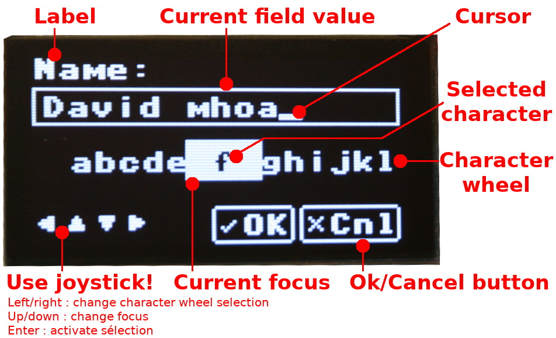
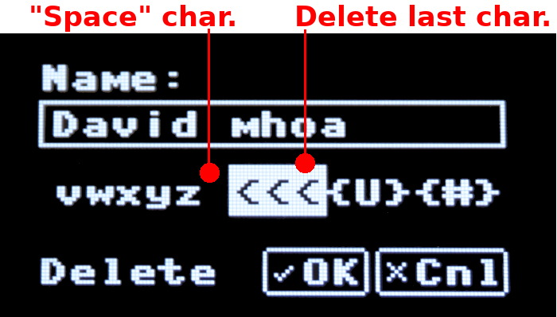
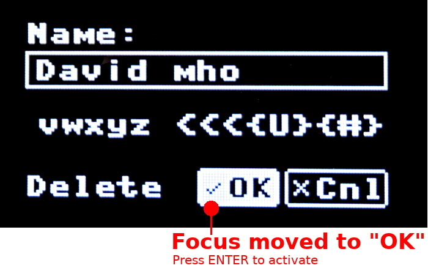
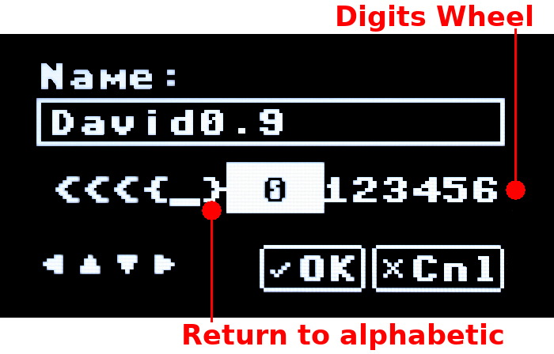

# Bibliothèque OledEdit

Le script [olededit.py](lib/olededit.py) contient la classe __EditScreen__ autorisant la saisie et le contrôle de données alphanumérique avec le joystick du Pico-Oled-Boot.

Le fonctionnement de l'éditeur est relativement intuitif. le joystick est utiliser pour sélectionner les caractères (gauche/droite), déplacer le focus (haut/bas) et de confirmer (presser). A noter que la direction HAUT sur roue des caractère permet de sauter plusieurs caractères d'un coup.










## Constantes
Les constantes `STATE_xxx` permet d'indiquer la roue de caractère à utiliser au démarrage.
``` python
STATE_NORMAL = const(0) # Display normal char
STATE_SHIFTED= const(1) # Display Uppercase Char
STATE_DIGIT  = const(2) # Display Digit + Decimal_Separator
STATE_SYMBOL = const(3) # Displat @, #, (, ...
```

## Classe EditScreen

La classe __EditScreen__ pilote l'afficheur pendant la saisie et rend la main à l'appelant à la confirmation ou abandon de la saisie.


### Constructor

```
def __init__( self, oled_boot, label, initial_value='', on_key_press=None, on_validate=None, initial_state=STATE_NORMAL )
```

* __oled_boot__ : référence sur l'objet __OledBoot__ (descendant de __FrameBuffer__) offrant l'accès à l'écran OLED ainsi qu'au différentes interfaces de contrôle.
* __label__ : libellé affiché au dessus de la zone de saisie.
* __initial_value__ : (optionnel, string) valeur initiale de la zone de saisie.
* __on_key_press__ : (optionnel) permet d'attacher un événement callback appelé juste avant l'ajout d'un caractère à la saisir. Permet de refuser l'ajout en retournant False. <br />Event(Owner,Key) où `owner` est l'instance EditScreen et `key` le code ASCII du caractère ajouté.
* __on_validate__ : (optionnel) permet d'attacher un événement callback permettant de vétifier la valeur encodée avant d'accepter la pression du bouton OK. La callback doit retourner True pour accepter la saisir. Les exceptions __ValueError__ sont également capturées et le message pendant une seconde.<br />Event(value) où `value` contient la valeur saisie
* __initial_state__ : (optionnel, constante STATE_xxx) état initial de la roue de caractères. Permet de présélectionner une alternative à la roue alphabétique.

### Attribut value : string

Valeur saisie par l'utilisateur.

### Méthode show() : boolean

``` 
def show( self ):
```

Démarre la saisie et retourne True lorsque la saisie est terminée (pression sur le bouton OK) ou False lorsque la saisie est abandonnée (pression sur le bouton Cancel).

La valeur saisie est disponible dans l'attribut `value`.
