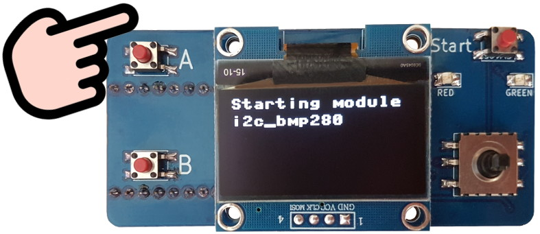
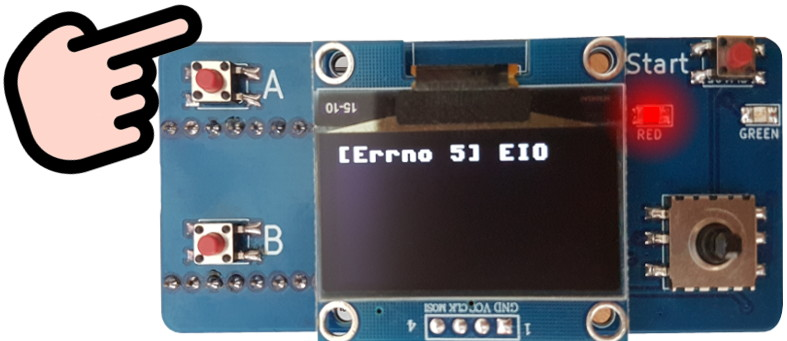
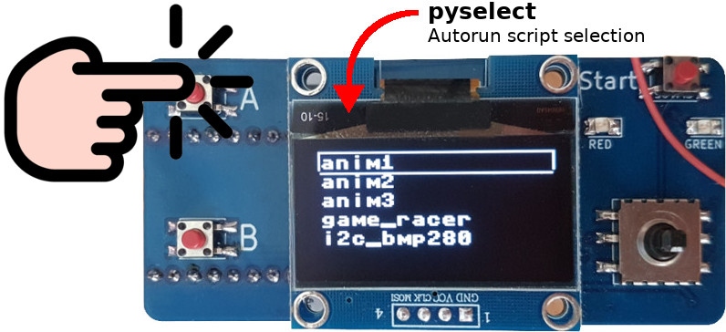
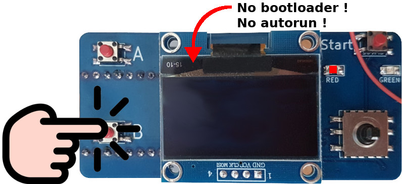
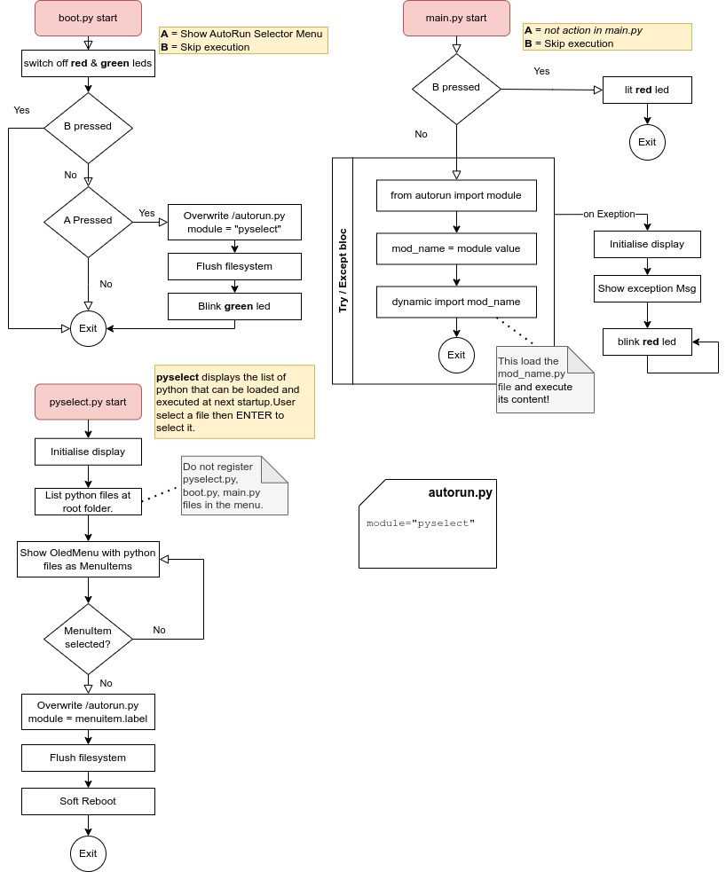

[Ce fichier existe également en Français](readme.md)

# BootLoader & AutoRun for MicroPython

## When starting

The bootloader check what was the latest script started then it starts it again.

If the target script failed then the bootloader captures the error and shows
it on the OLED display. The red LED also blinks signaling the error.

## Select another script 

At any moment, the user can select which script should be started.

Press the __A__ button while starting the microcontroler (power cycle or reset it!) 
will shows the selection menu.

This will show the scripts availables at the root of MicroPython filesystems.

Use the joystick to choose the script to run. Press joystick Enter to select.

The microcontoler will restart then load the selected script :-)

## Skip AutoRun

The bootloader and AutoRun can be neutralized when the MicroControler starts.

Just press the __B__ button at starts.

The red led will lit solid when autorun is skipped.

AutoRun & bootloader will restart again at next power-cycle/reset.

# How it works

