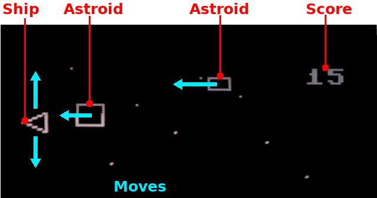

# Astroid game with Pico-Oled-Boot
Adapted from [DIY-Handheld-Arduino-Game-Console](https://github.com/Circuit-Digest/DIY-Handheld-Arduino-Game-Console) Arduino project.

Avoids the astroid by moving your ship up and down

## Know issues
* None

## Improvements

* Make the ship pointing to the right
* Implement starfield movement
* implement the draw_score()
* Improve astroid shape (or name the game Cuboid ;-)
