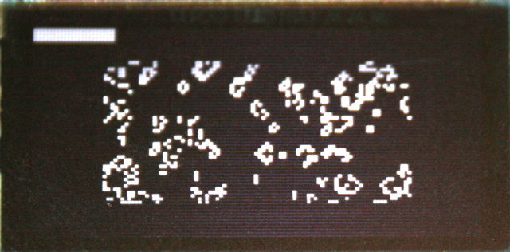
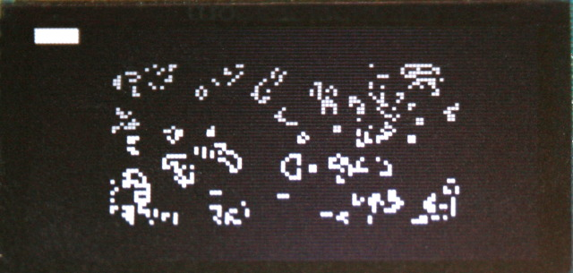

# The Conway Game of Life for Pico-Oled-Boot

The `conway.py` example initialize a 88 x 44 pixels with random value then execute the game of life frame after frame.

The very top of the screen shows a progress bar for the frame calculation progress (displayed only when more than 900 cells are calculated).

## Know issues

* None

## Improvements

* User interface to select Width and Height
* Improve calculation speed
* detect end of game (no changes anymore)