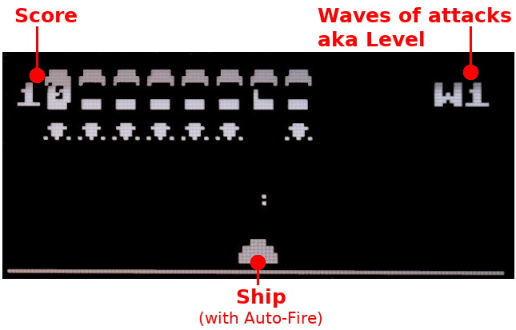

# Space Invaders game with Pico-Oled-Boot
Adapted from [DIY-Handheld-Arduino-Game-Console](https://github.com/Circuit-Digest/DIY-Handheld-Arduino-Game-Console) Arduino project.

## Know issues
* None

## Improvements

* make code more readable
* implement the draw_score()
* implement manual fire
