# Labyrinth - Find your way to the Flag

I always wanted to create a labyrinth game with MicroPython.

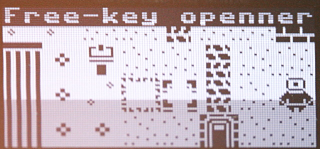

The dream is now made possible thanks to the "Tiled" open-source software and [1-bit-prison tileset (by yasriii)](https://yasriii.itch.io/1-bit-prison-pixel-art) available on itch.io

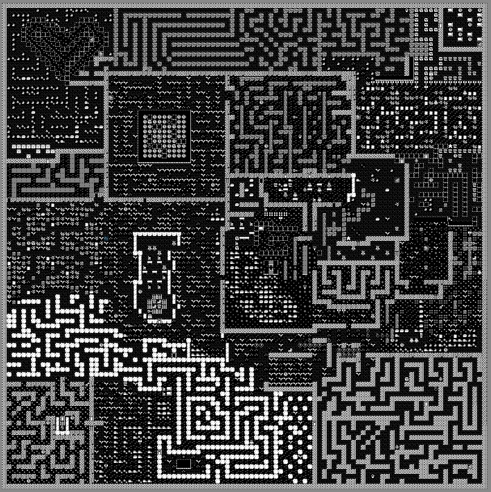

The very first level is made of 100 x 100 tiles, each having 16x16 pixels.

# ToDo list
* Having simplier/smaller level (level1 is massive)
* Make the ennemi moving
* Complete object action and conversion (like money, star, etc)

# Game player manual

Use the __joystick__ to navigate the labyrinth. 

Pressing the __A button__ displays the MAP (press again to quit). The user position is drawed as a blinking dot, the doors as triangle.

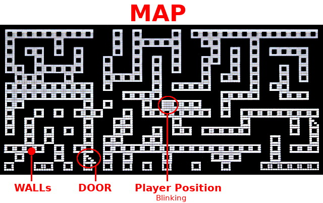

Pressing the __B button__ displays the INVENTORY of collected objects. Pressing again to quit.

The current player position is identified by the blinking cursor (a blinking square). 

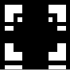

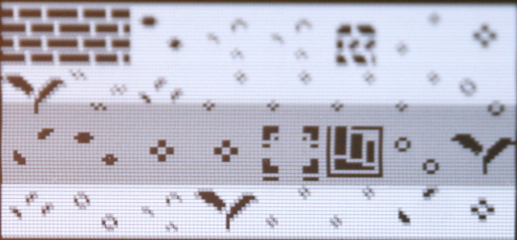

When the user cannot move in a direction (due to a wall or closed door) the cursor is replaced by a blinking cross for 1.5 sec.

Many tiles act as a wall... player cannot walk accross them. Big stone and big plant (at bottom left) will block the player.

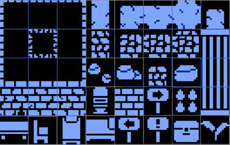

Background tiles act as grass, player can walk through them.

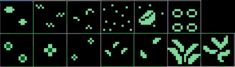

Player start with health of 100 %. 
Touching bomb, robot, animal, skull or bomb will decrease health when touching them!

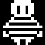 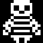 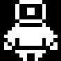  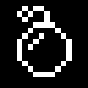 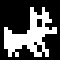 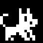 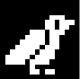 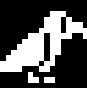 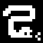 

An open door can be walked through. 

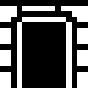

Closed door and portcullis could be open with key (collected in the labyrinth).

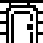  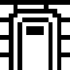  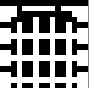

Various collectable objects and immediate action icons are available in the labyrinth.

| Object  | Glyph | Description |
| ------- | ----- | ------------------------ |
| key         | 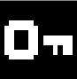 | Collectable. A key can open a closed door. |
| Mushroom    | 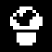 | Collectable. __not defined yet__  |
| Coin        | 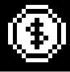 | Collectable. __not defined yet__    |
| Star        | 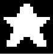 | Collectable. __not defined yet__    |
| Question    | 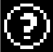 | Collectable.  __not defined yet__  |
| first aid   | 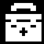 | Will refill health to 100%  |
| chronometer | 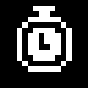 | Will allows the player to cross the door without key! Chronometer is active for only 20 seconds. The countdown is visible in the player cursor. Each chronometer can be actvated once. |
| Lever       | 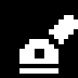 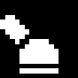 | __not defined yet__ |
| stairs      |   | Act as a teleporter to another stairs chosen randomly.  |
| Heart       | 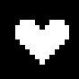 | __not defined yet__  |

# Want to create your own Level ?

The ressources are available in the [tiled-project/](tiled-project) subfolder. 

The Python script identifies the tiles by their unique ID. Different tiles may have different behaviors in the game (it is hardcoded in the script based on the Tile ID).

Here follows the initial attributes assigned to the tileset (some tiles are still unused)
[Initial TileSet attributes](docs/tileset-info-01.jpg)

The level in Tiled is made with 4 distincts layers:

* __map__ : made of wall and grass tiles
* __object__ : contains object tiles. Objects can be picked by the player and store into its inventory.
* __action__ : tiles that implies action when the user reach the tile (eg: open door, teleport, etc).
* __poeple__ : tiles with characters (enemies, start and end-of-game).

The Tiled folder must also contains additional files required by the compilation process.
* __wall.ids__ : comma separated list of tile_id as wall (Tile that player cannot walk through). Several lines are allowed.
* __door.ids__ : comma separated list of door door tile_ID. Each is is encoded as 8 digit integers (4 first digit for Closed door tile_ID followed by 4 last digit for Opened door tile_ID). Several lines are allowed. 

The playable level is made of the following ressources:

* level1.bpm : export of the __map__ layer __only__ as pbm image (100x100 tiles = 1600x1600px = 320Ko). Exported from Tiled software.
* tileset.bpm : the 16x16 TileSet as bpm format (used extract extra tiles for the game).
* level1.wall : a framebuffer having bits set to 1 at wall position. Compiled by `extract-level-data.py` .
* level1.json : containing various information including the lists for __object__, __action__, __poeple__, __door__ (each being list of [x,y,tile_id] entries). Compiled by `extract-level-data.py` .

The extra files are created with the compile-levels.sh script calling various python scripts. Notice that `show-wall.py` can be used to inspect the `.wall` file.