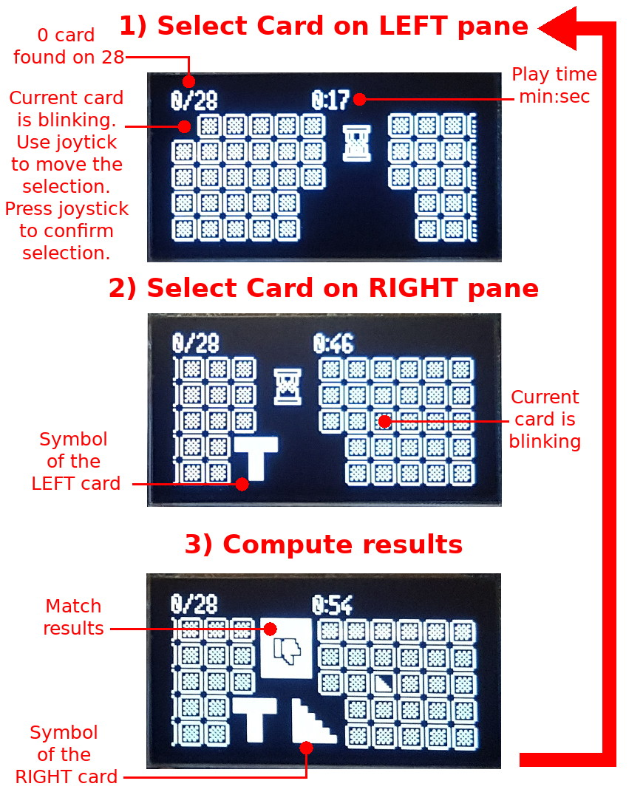

# Memory game for Pico-Oled-Boot
Quite simple on the principle, this game requires lot of concentration to associate  the 28 distinct cards!

It uses glyph/symbols to distinct the each cards (drawed in blue)

.jpg)

The gameplay switch between the left and right pane while selecting the card. The matching result is showned between the panes.

