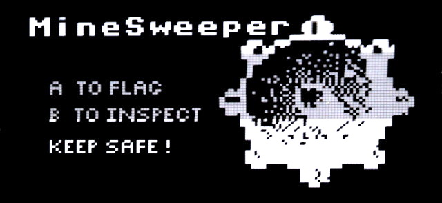
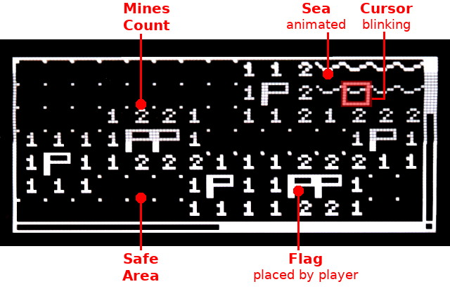
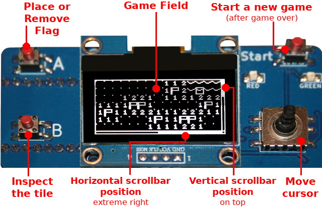
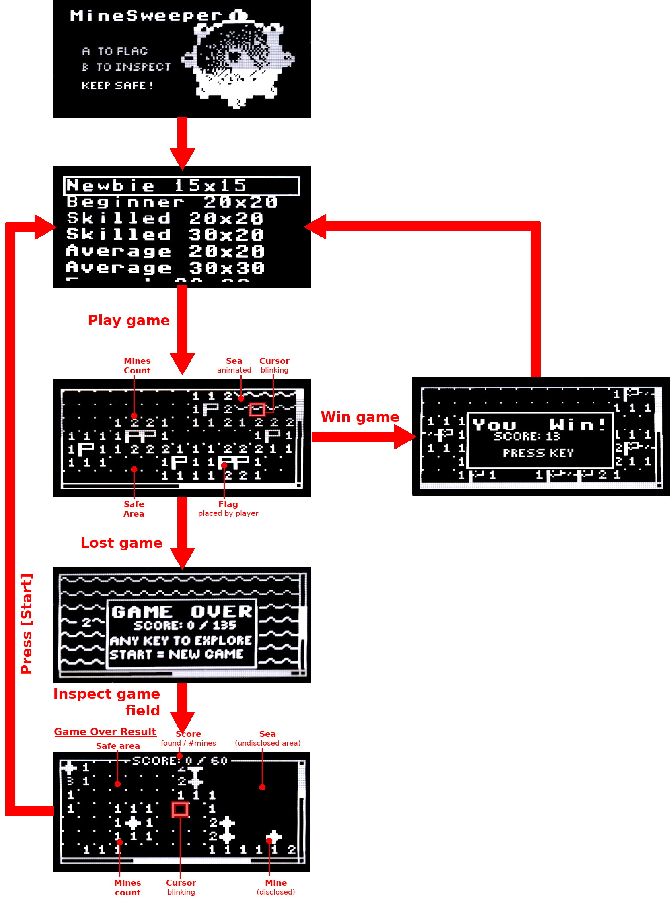
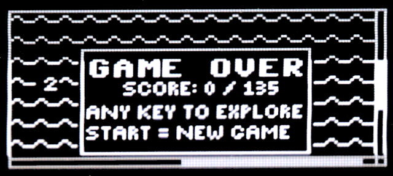
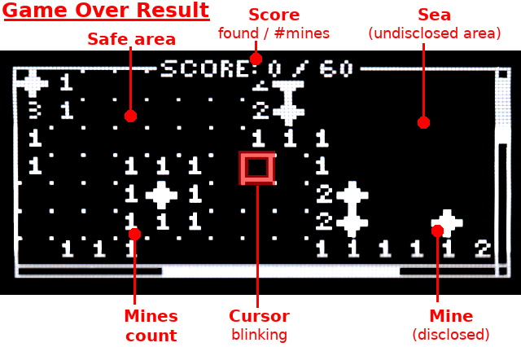

# MineSweeper game for Pico-Oled-Boot

Discover all the mines immerged into the sea.

Use the joystick to navigate the map

Press the A button to place/remove a flag over a mine.

Press the B button to inspect a cell. If there is a mine the game is finished, otherwise you discovered a secure sea portion.

## Game flow

The following diagram shows the organisation of the game play.

## When the game is over

When the Game is over, the user can navigate the game field and check the position of mines.

## Know issues
* None

## Improvements

* None

