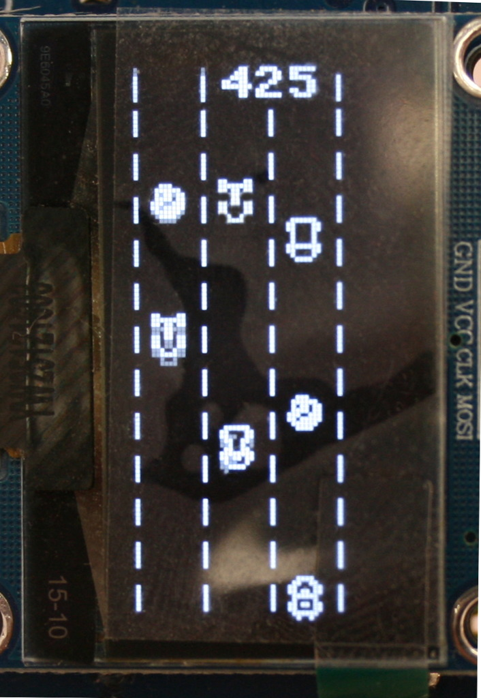
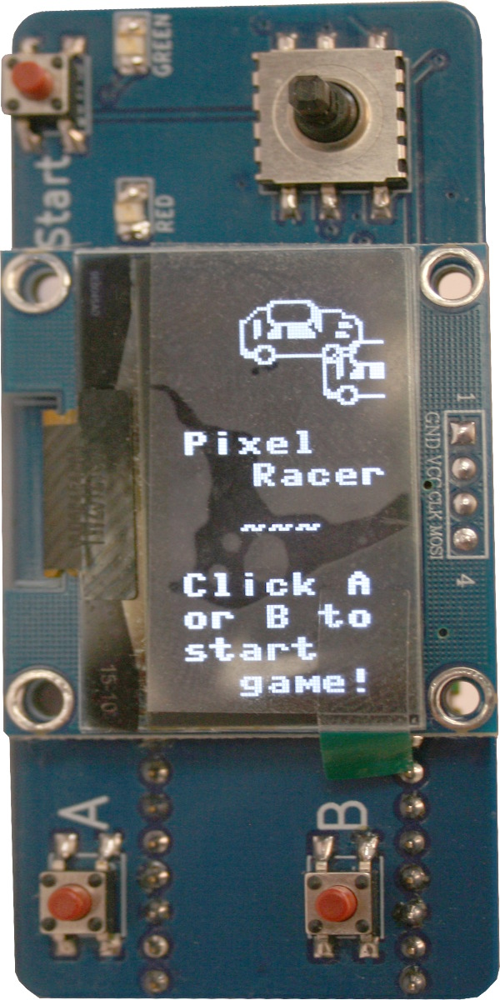
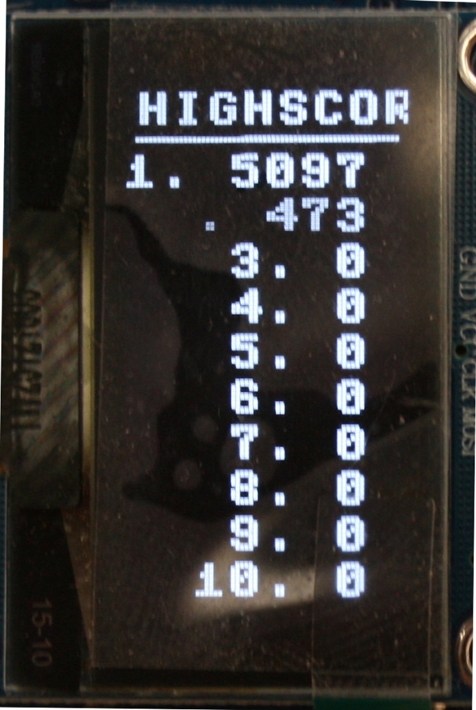

# OLED Retro Pixel Racer from Adidax
Adapted from Makerblot.at Arduino project.

Code improved to add more vehicule definition.

GPIO 16 is reserved for PWM buzzer.

Ideas: Adding effet 
 - Speedy    : Allow Car to move forward by pressing A+B (will slowly get back to its bottom position when releasing A+B)
 - Weapon    : Allow Car to explore front obstable with A+B (limit it to 3 times)
 - Magic Wand: Allow to explode all obstacles on the lanes with Magic action (A+B, only once)

Maybe allow the user to select its prefered effect before starting the game.

Original Source:
* https://github.com/adidax/oled-retro-pixel-racer/tree/main
* https://www.makerblog.at/

## Know issues
* '''Welcome Screen text is too large''' implemented some text sizing or small font support (see Arduino FBGFX).