[Ce fichier existe également en Français](readme.md)

The folder __example/games/__ contains many game examples.

__[racer/racer.py](racer/racer.py)__ : Racing game. See the [game readme](racer/readme.md) file.

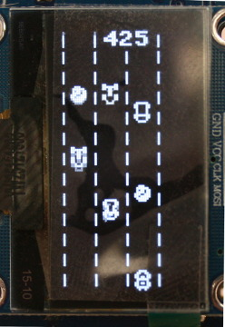

__[flappy/flappy.py](flappy/flappy.py)__ : Ardu Flappy game adapted to MicroPython (a flappy bird clone alike).  See the [game readme](flappy/readme.md) file.

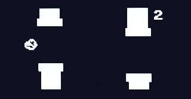

__[memory/memory.py](memory/memory.py)__ : The "Memory" game not as simple as it may look at first sight! See the [game readme](memory/readme.md) file.

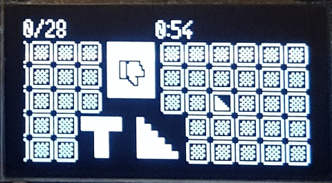

__[conway/conway.py](conway/conway.py)__ : Implementation of the Conway game of life for Pico-Oled-Boot (area of 88x44). Also exists with 30x30 area with  [conway/conwaysmall.py](conway/conwaysmall.py).  See the [game readme](conway/readme.md) file.

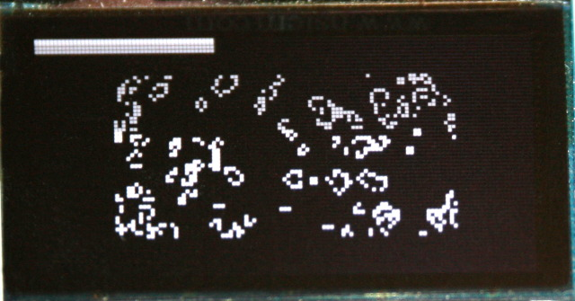

__[tetris/tetris.py](tetris/tetris.py)__ : Implementation of the Tetris game for Pico-Oled-Boot. See the [game readme](tetris/readme.md) file.

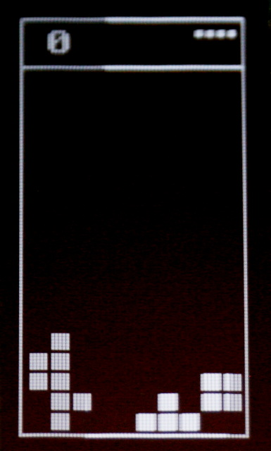

__[labyrinth/labyrinth.py](labyrinth/micropython/labyrinth.py)__ : Labyrinth game with Level Editing instruction for Pico-Oled-Boot. See the [game readme](labyrinthracer/readme.md) file.

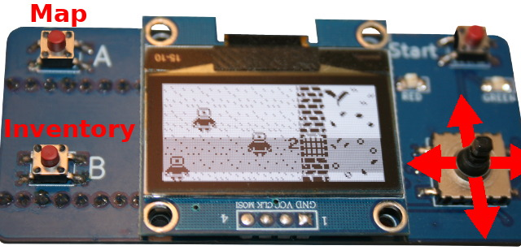

__[breakout/breakout.py](breakout/breakout.py)__ : brick-breaker game like Breakout for the Pico-Oled-Boot. See the [game readme](breakout/readme.md) file.

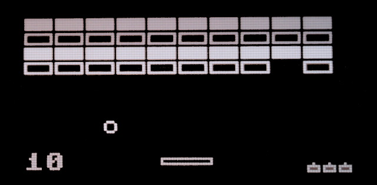

__[dino/dino.py](dino/dino.py)__ : Dino game for Pico-Oled-Boot in its simplified version. See the [game readme](dino/readme.md) file.

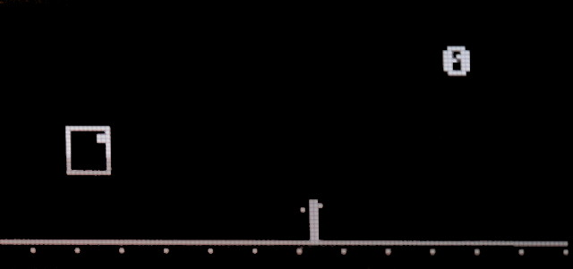

__[invaders/invaders.py](invaders/invaders.py)__ : Space Invaders games for Pico-Oled-Boot. See the [game readme](invaders/readme.md) file.

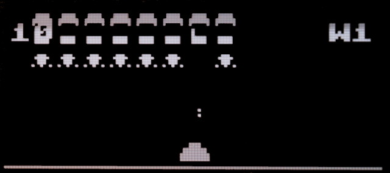

__[dotman/dotman.py](dotman/dotman.py)__ : Collect the dots before the ghost catch you. It is a bit like PacMan without the  labyrinth.  See the [game readme](dotman/readme.md) file.

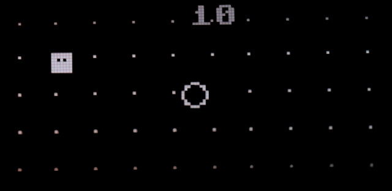

__[astroid/astroid.py](astroid/astroid.py)__ : Avoids the astroids as long as you can! See the [game readme](astroid/readme.md) file.

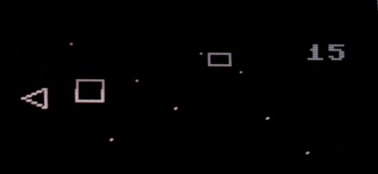

__[tank/tank.py](tank/tank.py)__ : Tansform your screen into a tank battle field! See the [game readme](tank/readme.md) file.

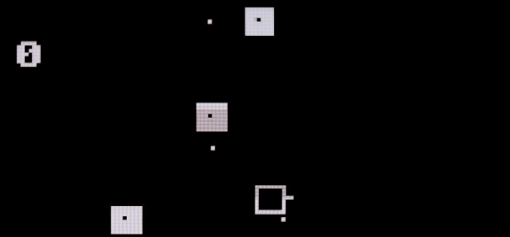

__[snake/snake.py](snake/snake.py)__ : A funny implementation of the Snake game! See the [game readme](snake/readme.md) file.

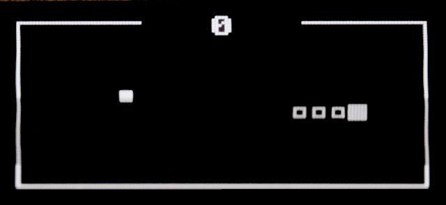

__[minesweeper/minesweeper.py](minesweeper/minesweeper.py)__ : An implementation of the minesweeper game! See the [game readme](minesweeper/readme.md) file.

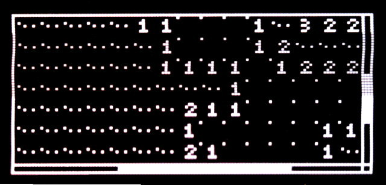
