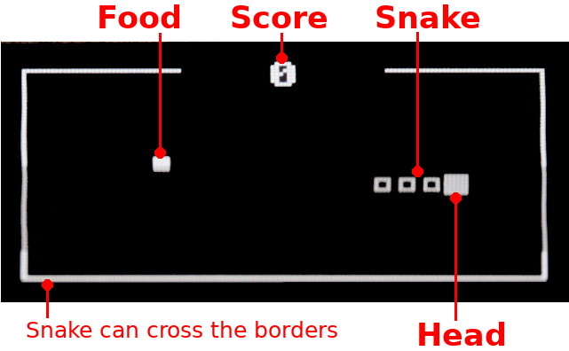

# Snake game with Pico-Oled-Boot
Adapted from [DIY-Handheld-Arduino-Game-Console](https://github.com/Circuit-Digest/DIY-Handheld-Arduino-Game-Console) Arduino project.

Just eat the food but not the snake himself.

This version of the game allows the snake to cross boundaries and appears on the opposite border... it is very funny.

The max snake length is 80 sections

## Know issues
* None

## Improvements

* Food design can be improved

