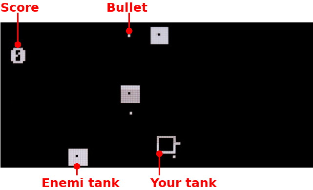

# Tank game with Pico-Oled-Boot
Adapted from [DIY-Handheld-Arduino-Game-Console](https://github.com/Circuit-Digest/DIY-Handheld-Arduino-Game-Console) Arduino project.

Your tank can move and send bullet when B button is pressed and release.

Ennemi can also do so (up to 3 ennemi in the field)

## Know issues
* Game is a bit too fast for beginner

## Improvements

* Tank design can be improved
* implement the draw_score()

