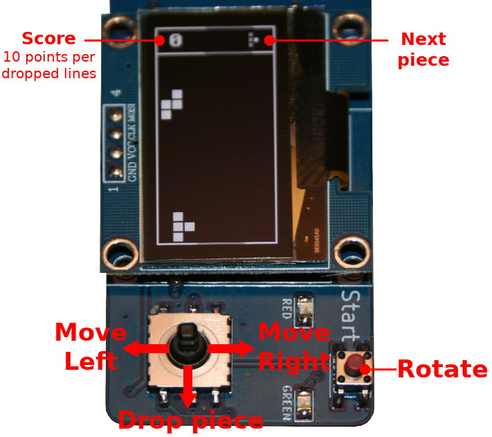

# Tetris for Pico-Oled-Boot

This game `tetris.py` is a portage of the [Tetris Game for Arduino created by Electrofrikis](https://youtu.be/AJirbbCUdwY?si=cJlkSsqpL5Z3x4bI) (YouTube and ressources).

The game use a portrait orientation and the joystick to move the piece. The "Start"" button is used tp rotate the piece.

## Know issues

* None

## Improvements

* Add intro and score screens
* Increase drop speed.
* Animation when line is dropped
* Some sound and music ?