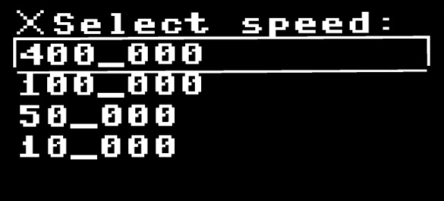
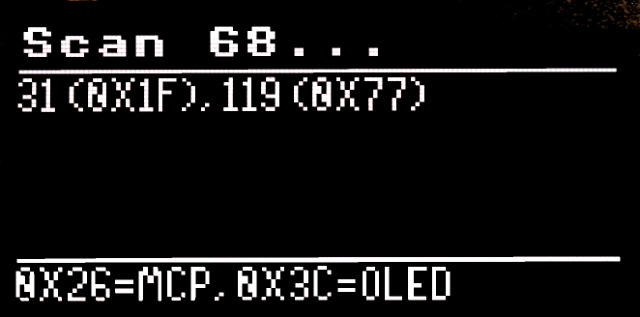
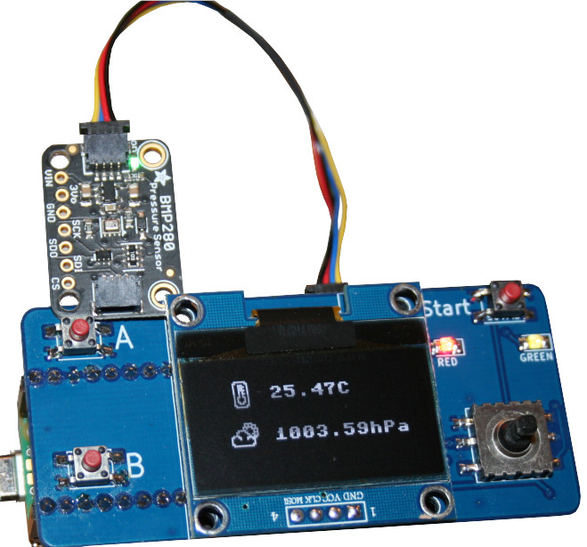

[Ce fichier existe également en Français](readme.md)

# I2C Scanner

The __[test_i2c_scanner](test_i2c_scanner.py)__ example allows you to reconfigure the Pico-Oled-Boot I2C bus at various standard speed then scan the bus existing I2C address.

The scan is performed every 2 seconds and results displayed on the screen.

Scan errors are also reported on the display.

Remark:

* I2C bus speed also affects the display & joystick refresh time.
* Standard timeout is 50_000 microsecond. It is increased to 500_000 uSec for low speed.
* Oled and MCP GPIO expander are filtered from results (but displayed at bottom).

# Other examples

* __[test_i2c_bmp280.py](test_i2c_bmp280.py)__ : connect a BMP280/BME280 sensor on the Qwiic/StemmaQT, read the data then display it on the screen (with icon). 
* __[test_i2c_mcp9808.py](test_i2c_mcp9808.py)__ : Connect a MCP9808 temperature sensor on the Qwiic/StemmaQt sensor, read the data and display it on the OLED display.
