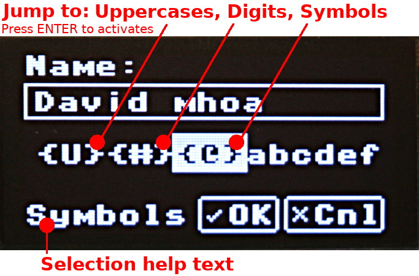

[Ce fichier existe également en Français](readme.md)

* __[test_input_screen.py](test_input_screen.py)__ : Display an edit field to encode data 
* __[test_input_keypress.py](test_input_keypress.py)__ : Character validation before adding it to the encoded value.
* __[test_input_validate.py](test_input_validate.py)__ : Validate tje `value` when the OK button is activated. 
