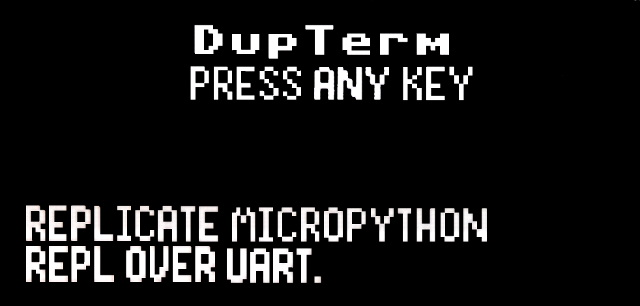
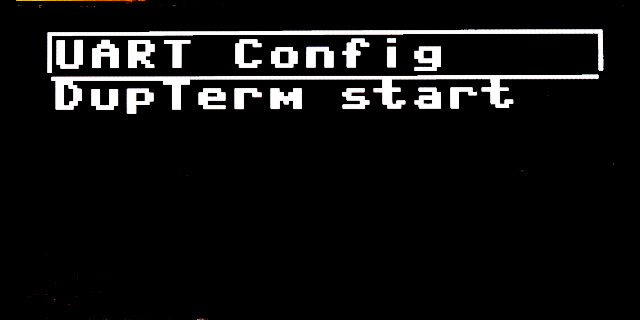

# Replicate MicroPython REPL on UART lines

This small script allow the user to configure the UART setting then

dupterm the REPL on that UART.

Pressing the key show the configuration menu.

The offers the following entries:

* __UART Config__ : is used to setup the UART parameter.
* __DupTerm start__ : start the MicroPython REPL on UART

Final screen show reminder about:

* Current configuration of the UART
* Physical UART pinout

