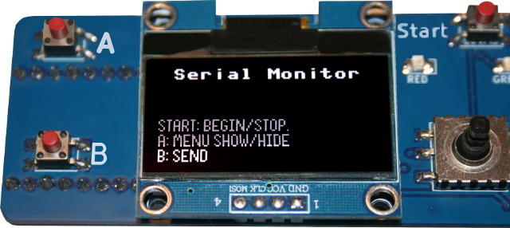

[This file also exists in ENGLISH here](readme_ENG.md)

# Serial Monitor

L'exemple __[serial Monitor](serial-monitor)__ est un petit équivalent du Serial Monitor d'Arduino. Celui-ci est lié à l' UART(0) avec tx=GP0 et rx=GP1 .

Plus d'information sur le [fichier readme](serial-monitor/readme.md) dédicacé.

# USB Serial Passthrough

L'exemple __[usb-serial](usb-serial)__ permet de configurer l'UART puis transforme l'USB en périphérique USB CDC (port serie) avant de transférer le contenu de l'un vers l'autre (et vice-versa).

Plus d'information sur le [fichier readme](usb-serial/readme.md) dédicacé.
