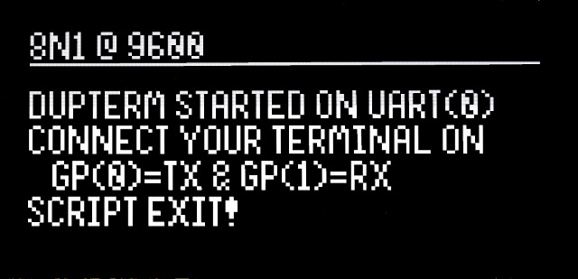

[This file also exists in ENGLISH here](readme_ENG.md)

# Serial Monitor

L'exemple __[serial Monitor](serial-monitor)__ est un petit équivalent du Serial Monitor d'Arduino. Celui-ci est lié à l' UART(0) avec tx=GP0 et rx=GP1 .

Plus d'information sur le [fichier readme](serial-monitor/readme.md) dédicacé.

# USB Serial Passthrough

L'exemple __[usb-serial](usb-serial)__ permet de configurer l'UART puis transforme l'USB en périphérique USB CDC (port serie) avant de transférer le contenu de l'un vers l'autre (et vice-versa).

Plus d'information sur le [fichier readme](usb-serial/readme.md) dédicacé.

# dupterm

L'exemple __[uart-dupterm](uart-dupterm)__ permet de configurer l'UART puis répliquer l'invite REPL sur l'UART. Une fois fait, l'exécution du script s'achève. 

L'utilisateur peut prendre le contrôle de la plateforme MicroPython via l'UART (avec Thonny, MPRemote, RShell ou un logiciel terminal). 

Plus d'information sur le [fichier readme](dupterm/readme.md) dédicacé.

