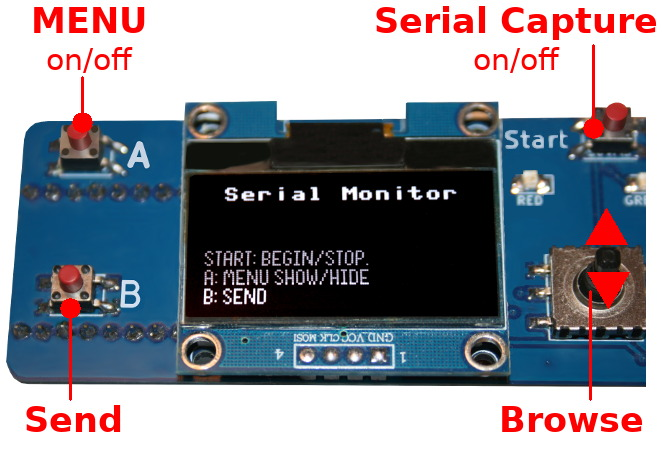
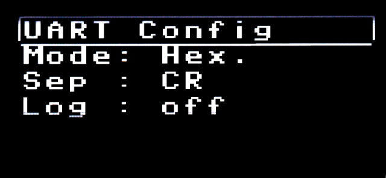
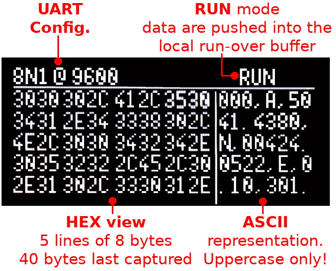
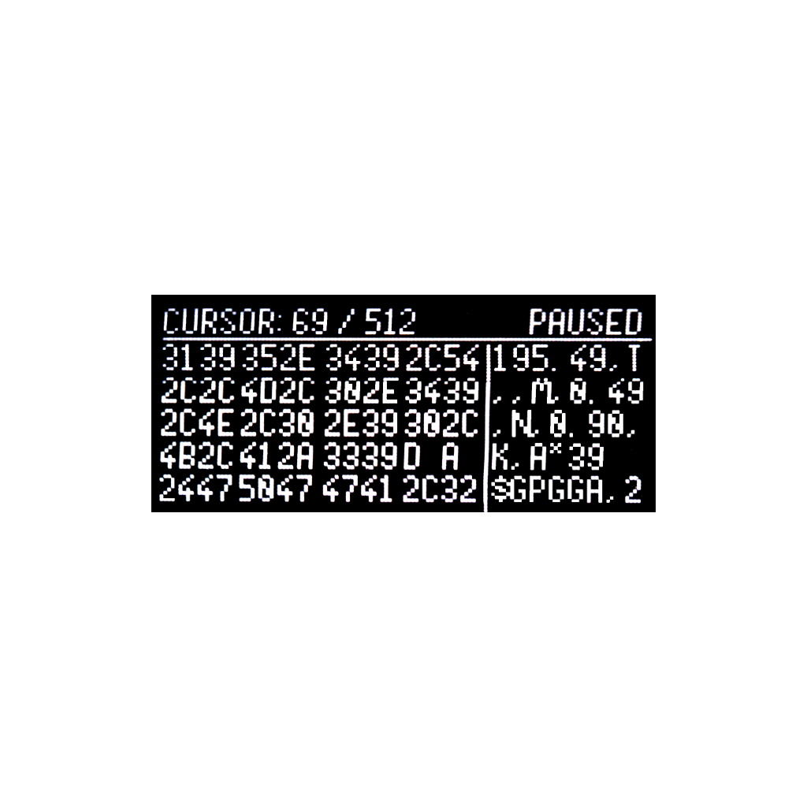
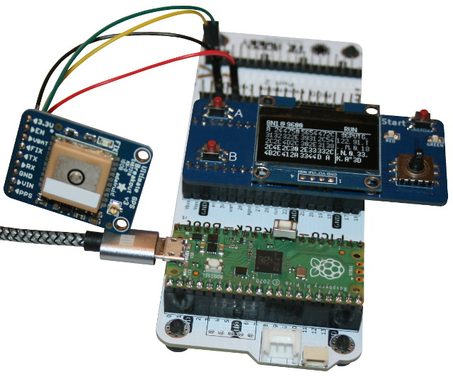

# Serial Monitor for the Pico-Oled-Boot 

The __[serial Monitor](serial-monitor)__ example is a small Arduino alike Serial Monitor linked to UART(0) with tx=GP0 and rx=GP1 .

## Menu

The Menu activated with button A can be used to configure the several options:

* __Config__ : configure the UART (baudrate, databits, parity, stop bits). Select the "__Apply__" option to update UART the settings and display the main screen.
* __Mode__ : Display mode of captured data. __HEX__ for hexadecimal display, __ASCII__ for plain text display, __PLOTTER__ to capture numeric values and display graphics.
* __Sep__ : end of line separator used when sending sending message (press B button). May be CR, LF, CRLF or None.
* __Log__ : Log to file option (to be defined)

## Capture : Hex mode

The data capture screen is show when exiting the menu (or the intro screen).

The way it displays data depends on the display __mode__ selected in the the menu.

When running, the UART data are pushed into a roll-over buffer of 1024 Bytes (see RING_BUF_SIZE constant in the script).

Pressing the __Start__ button will pause the data capture and allow user to browse the captured data with the joystick (UP & DOWN). Be patient, with the joystick, the screen requires 700ms to refresh.

Press __Start__ button again to restart the data capture.

# Wiring

Wiring an UART based device like a GPS to the UART(0). 

* GP0 = UART(0).TX
* GP1 = UART(0).RX

The following picture shows a Pico-Rack-Boot to bring the connexion to the GPS.

# Limitation
The 8x4 font used for this application only displays uppercase chars. 

# TO DO list

* Send feature
* ASCII display
* PLOTTER display
* Log to file

