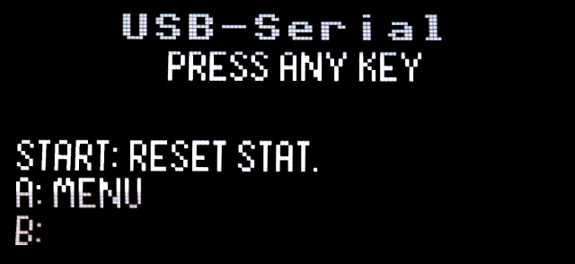
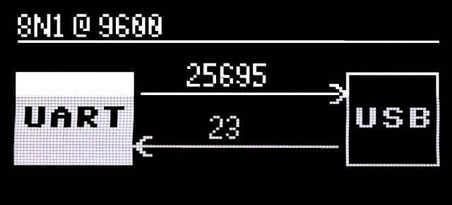

# USB-Serial Pass-Through

The [UsbSerial.py](usbserial.py) example establish a passthrough connexion between the USB port and the UART(0) on GP0=tx and GP1=rx.

UART(0) can be configured in baudrate, data bits, parity, stop bits thank to the menu (Press A button to bring up the menu)

Once started, the script display a statistic screen showing the bytes transfered in each direction.

Statistics can be reset at any moment by pressing the "Start" button.

__Important Note:__

The USB connexion get reset when the script initialise the USBDevice layer.

# Library

Running this examples requires the __Advanced USB Device__ support to be installed.

The installation is described in this [USBDevice install documentation](../../doc-usbdevice_ENG) .

