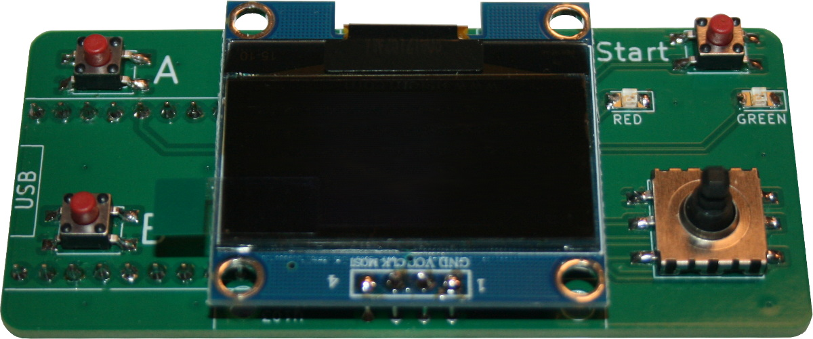
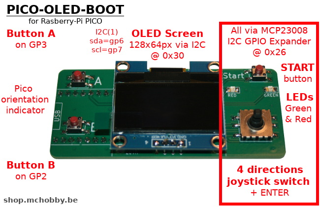
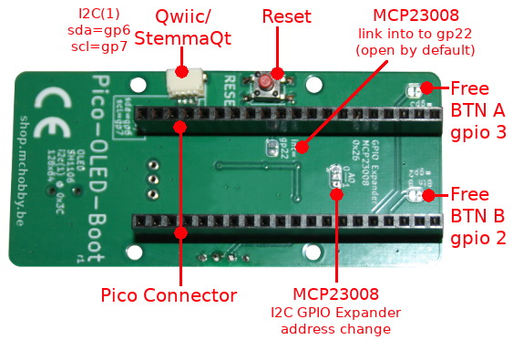
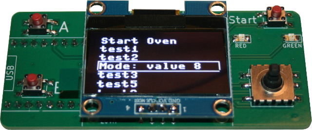
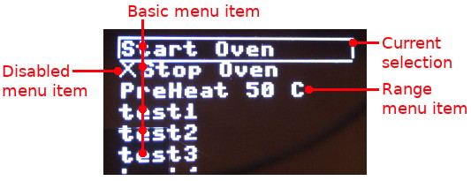
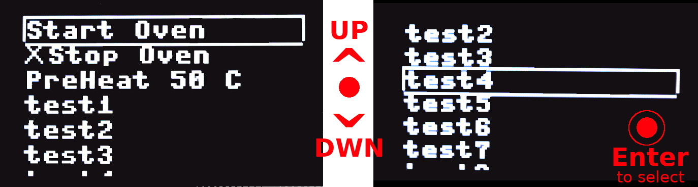
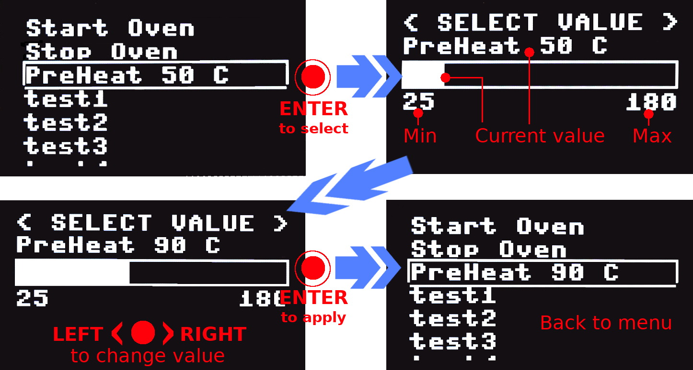
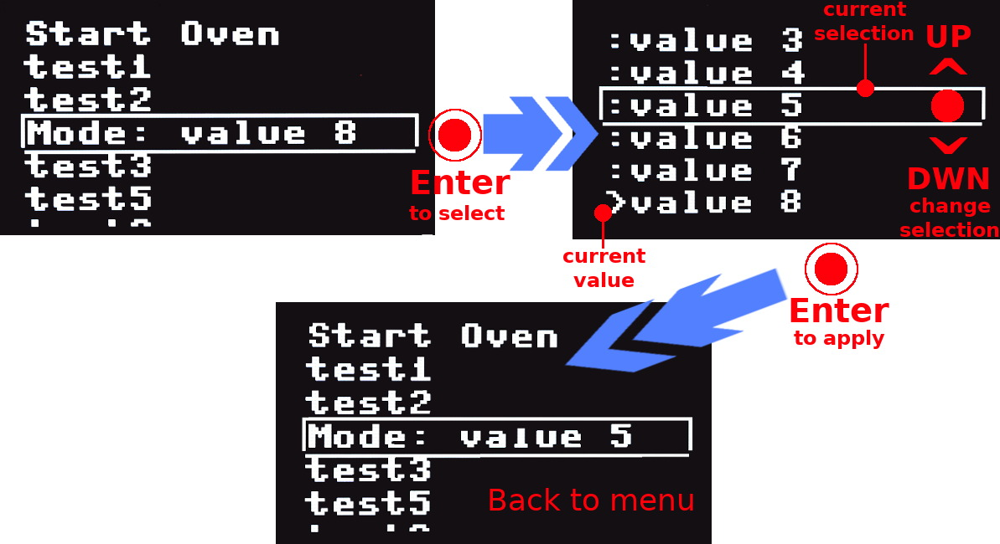
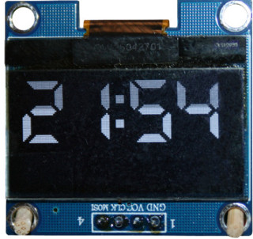

[This file also exist in English](readme_ENG.md)

# PICO-OLED-BOOT : un controleur graphique tout-en-un pour Pico (MicroPython compatible)

Le PICO-OLED-Boot est un complément intéressant pour ajouter une interface graphique (OLED, 128x64px) et des contrôles utilisateurs (joystick switc, buttons) à sur votre projet. 

Deux LEDs sont également disponibles pour offrir des notifications utilisateurs complémentaires.



Le Pico-Oled-Boot exposeégalement un connecteur Qwiic/StemmaQt et un bouton Reset sous la carte de sorte à rester rapidement et facilement accessible.

Grâce au MCP23008 (GPIO expander), le Pico-Oled-Boot peut être contrôlé à l'aide de 4 broches. Deux broches sont utilisées pour le bus I2C (gp6/gp7). Les deux autres broches (gp2/gp3) sont utilisées pour les boutons A & B permettant ainsi d'utiliser les interruptions.

Cette architecture laisse de nombreux entrées/sorties et bus disponibles pour votre propre projet.





Côté logiciel, vous disposez de tous les bibliothèques MicroPython nécessaires, ainsi qu'une bibliothèque __menuboot__ complémentaire permettant __d'implementer rapidement un MENU__ avec ce produit.



Le [schéma est également disponible ici](docs/_static/pico-oled-boot-schematic.jpg)

# Bibliothèque

La bibliothèque doit être copiée sur votre carte MicroPython MicroPython avant de pouvoir exécuter les exemples.

Bibliothèque absolument nécessaires:

* __oledboot__ : HELPER facilitant l'acc!s aux fonctionnalités de Pico-Oled-Boot.
* __menuboot__ : affichage et gestion de MENU.
* __sh1106__ : gestion de l'OLED.
* __mcp230xx__ : lecture du joystick


## Installer avec MPRemote

Sur une plateforme WiFi:

```
>>> import mip
>>> mip.install("github:mchobby/pico-oled-boot")
```

Ou via l'utilitaire mpremote :

```
mpremote mip install github:mchobby/pico-oled-boot
```

## Installation manuelle

Vérifiez le contenu du fichier [package.json](package.json) pour identifier les différentes bibliothèques et copier les fichiers sur votre carte micropython.

# Brancher

Insérer votre carte Pico sur le connecteur femelle présent à l'arrière de votre carte. La présence du libellé __USB__ sur le Pico-Oled-Boot permet d'orienter le Pico (son connecteur USB doit être orienté dans la même direction)

# Test

## Direction du joystick
Le script suivant permet de détecter l'orientation du joystick, son bouton Enter et la bouton Start. Ces informations sont affichées sur l'écran OLED.

```
from oledboot import *
import time
import micropython
micropython.alloc_emergency_exception_buf(100)

# Right=Droite, Left=Gauche, Up=Haut, Down=Bas
labels = {START:"Start", ENTER:"Enter", UP:"Up", DOWN:"Down", LEFT:"Left", RIGHT:"Right"}
lcd = OledBoot()
# Initialiser l'écran
lcd.fill(0)
lcd.show()

while True:
	lcd.fill(0) # Effacer
	_d = lcd.dir # obtenir la direction
	if _d in labels:
		lcd.text( labels[_d],0,0,1 ) # Texte,x,y,couleur
	elif _d > 0: # 0=pas de direction
		lcd.text( str(_d), 0,0, 1 )
	lcd.show()
	time.sleep_ms( 100 )
```

Note: `dir` retourne 0 lorsque rien est détecté. Lors d'une combinaison de boutons (UP + Start) est détectée, leurs constantes sont sommées. Dans pareil cas, le script affiche une valeur numérique (à la place d'une combinaison de libellés).

Remarques: 

1. La détection précise peut également être effectuée avec une expression similaire à `(dir and RETURN)== RETURN`
2. Chaque accès à la propriété `dir` provoque un transfert sur le bus I2C. La bonne pratique consiste à copier la valeur retournée par `dir` dans une variable locale.

## Lecture des boutons A & B

Etant donné que les boutons sont des object de type `Pin`, les valeurs peuvent être obtenues à l'aide d'expression similaire a `OledBoot.a.value()`. La classe `Pin` permet d'attacher une routine d'interruption sur le bouton.

L'exemple ci-dessous attache une routine d'interruption (IRQ) sur les boutons A & B. Ces routines change l'état des LEDs utilisateurs rouge (Red) et verte (Green) à chaque pression du bouton correspondant.

```
from oledboot import *
import time
import micropython
micropython.alloc_emergency_exception_buf(100)

lcd = OledBoot()

# Utiliser les boutons A & B avec IRQ
last_a = time.ticks_ms()
def a_pressed( pin ):
	global lcd, last_a
	# évite 2 activations consécutives sur 100ms
	if time.ticks_diff( time.ticks_ms(), last_a ) > 100:
		lcd.red.value( not(lcd.red.value()) )
		last_a = time.ticks_ms()

last_b = time.ticks_ms()
def b_pressed( pin ):
	global lcd, last_b
	if time.ticks_diff( time.ticks_ms(), last_b ) > 100:
		lcd.green.value( not(lcd.green.value()) )
		last_b = time.ticks_ms()

lcd.a.irq( handler=a_pressed, trigger=Pin.IRQ_RISING )
lcd.b.irq( handler=b_pressed, trigger=Pin.IRQ_RISING )
``` 

# Bibliothèque OledBoot

Le script [oledboot.py](lib/oledboot.py) contient la classe __OledBoot__ ainsi que la définition de différentes constantes.

Seul les definitions essentiels sont reprises ci-dessous.

## Constantes

Les constantes suivantes sont utilisées pour identifier les différentes directions du joystick. Les constantes couvrent également la détection du bouton "Start" ainsi que la pression sur le joystick ("Enter").

```
DOWN = const(1) # BAS
UP   = const(8) # HAUT
RIGHT= const(4) # DROITE
LEFT = const(16)# GAUCHE
ENTER= const(2)
START= const(32)
```

A noter qu'orienter le joystick vers le haut (UP) en le pressant (ENTER) retournera une valeur composée ENNTER+UP (soit 10). La valeur 0 est retournée lorsqu'aucune direction n'est détectée.

## Classe OledBoot

La classe __OledBoot__ permet d'accéder rapidemennt aux fonctionnalités de l'écran, des entrées et des sorties. La classe prend en charge l'allocation des ressources nécessaires.

La classe __OledBoot__ hérite du [FrameBuffer Micropython](https://docs.micropython.org/en/latest/library/framebuf.html) proposant ainsi les différentes primitives de dessins (voir [la documentation ici](https://docs.micropython.org/en/latest/library/framebuf.html))

Remarque:

La bibliothèque FBGFX (egalement installée avec MPRemote) peut être utilisé pour étendre les possibilités de FrameBuffer. Voyez la [documentation FBGFX ici](https://github.com/mchobby/esp8266-upy/tree/master/FBGFX))

### Constructeur

``` 
def __init__( self, oled_addr=0x3c, mcp_addr=0x26 )
```

* __oled_addr__ : Adresse I2C de l'afficheur OLED. Elle peut-être modifiée à l'arriere de l'écran. Dans pareil cas, indiquer la nouvelle adresse ici.
* __mcp_addr__ : Adresse I2C du _GPIO expander_. cette adresse peut être modifiée à l'arriere ce la carte à l'aide d'un cavalier à souder 3 positions (couper la trace en place et souder la partie opposée sur le plot central). Indiquer ici la nouvelle addresse I2C lorsque celle-ci à changé.

### Attribut i2c : I2C

Offre un accès direct au bus I2C partager entre l'écran OLED, le _GPIO expander_ et du port Qwiic/StemmaQt.

Cette référence sera utile lorsque vous connectez un périphérique supplémentaire sur le port Qwiic/StemmaQt.

### Attributs a: Pin , b: Pin

Offre un accès aux boutons A ou B. Comme ce sont des instances de classe Pin,le script utilisateur peut accéder à la méthode `value()` ou y attacher un _IRQ handler_.

La valeur retournée est __`False` lorsque le bouton est pressé__ et `True` lorsqu'il est relâché.

### Attributs red: LedAdapter, green: LedAdapter

Propose un accès aux LEDs verte (__green__) et rouge (__red__) situées au dessus du joystick.

La classe `LedAdapter` permet d'accéder aux methodes `value()`, `on()` et `off()` permettant ainsi de controler une LED si c'était un objet `Pin`.

### Attribut dir: int

Vérifie l'état du joystick (et bouton _Start_) puis retourne une des constantes DOWN, UP, RIGHT, LEFT, ENTER, START sinon retournera 0.

A noter que si plusieurs actions sont combinées comme RIGHT+START or LEFT+START+ENTER alors les différentes constantes impliquées sont sommées ensembles.

## Classe LedAdapter

La classe __LedAdapter__ est conçue pour contôler les LEDs connectées sur le __GPIO expander__ (MCP23008) comme si elles étaient attachées sur des broches du microcontrôleur (donc comme des objets de type `Pin`). 

Par conséquent la LED rouge (_red_) et LED verte (_green_) peuvent être commandé avec les méthodes:

* __on()__ : active la LED
* __off()__ : désactive la LED
* __value()__ : utilise le paramètre booléen pour activer/désactiver la LED. Sans paramètre: retourne le dernier état connu.

# Bibliothèque MenuBoot

Le script [menuboot.py](lib/menuboot.py) contient la classe __MenuBoot__ utilisée pour afficher, gérér et détecter l'activation d'une enntrée menu sur l'écran OLED.

MenuBoot permet l'affichage de:

* __basic MenuItem__ avec un code+libellé (pouvant être activé/désactivé)
* __range MenuItem__ pour sélectionner une valeur numérique parmi une gamme de valeurs.
* __combo MenuItem__ pour sélectionner une valeur dans une liste prédéfinie de clé-valeur
* __custom MenuItem__ pour créer une action personnalisée sur une entrée menu (aussi dit "Screen")

Les __basic MenuItem__ permettent au script utilisateur d'exécuter la tâche tandis que les __range, combo, custom MenuItem__ sont complètement automone (ne nécessite pas de code utilisateur pour fonctionner). A noter que le "custom MenuItem" permet néanmoins de lier du code utilisateur au fonctionnement du MenuItem (le dit "Screen").

## Classe MenuBoot
Un menu est construit à l'aide de la classe `MenuBoot`. Le script ci-dessous indique comment créer des entrées dans le menu. Les méthodes principales sont: `add_label()` , `start()` et `update()`. Le MenuItem sélectionner peut être identifier à l'aide de la propriété `selected`.





Le bout de code ci-dessous indique comment:

1. Créer un menu, 
2. L'afficher (et utiliser UP et DOWN pour se déplacer dans le menu) 
3. Etre informé de l'entrée sélectionné avec ENTER.

Voir le script [test_menu_basic.py](examples/test_menu_basic.py) pour plus de détails.

``` 
from oledboot import *
from menuboot import *

lcd = OledBoot()
menu = MenuBoot( lcd )

menu.add_label( "start", "Start Oven" ) # code, Label
menu.add_label( "stop" , "Stop Oven" , enabled=False )
menu.add_range( "preheat" , "PreHeat %s C", 25, 180, 5, 50 ) # Min, Max, Step, default
menu.add_label( "t1", "test1" ) 
menu.add_label( "t2", "test2" ) 
menu.add_label( "t3", "test3" ) 
menu.add_label( "t4", "test4" ) 
menu.add_label( "t5", "test5" ) 
menu.add_label( "t6", "test6" ) 
menu.add_label( "t7", "test7" ) 
menu.add_label( "t8", "test8" ) 

menu.start()
while True:
        if menu.update(): # True lorsqu'unne entrée est sélectionnnée
                entry = menu.selected # Lu une seule fois
                if entry:
                        print( "%s selected" % entry )

                        if entry.code=="start":
                                menu.by_code("stop").enabled=True
                        elif entry.code=="stop":
                                menu.by_code("stop").enabled=False
        # effectuer vos autres tâches ici
```

Seul les éléments fondamentaux sont décris ci-dessous.

### Constructeur

``` 
def __init__( self, oled_boot )
```

Connstructeur du Menu, prend un objet OledBoot (l'écran OLED) en référence.

### Méthode add_label()
Ajoute un libellé (_label_) dans le menu. 

L'action d'une telle entrée est gérée directement par le script utilisateur.

```
def add_label( self, code, label, enabled=True ):
```

* __code__ : identification unique du MenuItem.
* __label__ : libellé __statique__ affiché dans le menu. 


### Méthode add_range()

Ajoute une entrée de type RANGE dans le menu.



```
def add_range( self, code, label, min_val, max_val, step, default_val, enabled=True ):
```

* __code__ : identification unique du MenuItem.
* __label__ : libellé __dynamique__ affiché dans le menu et l'écran de sélection de valeur. Le spécificateur de format __"%s" (requis) est remplacé__ avec la valeur actuelle du paramètre.
* __min_val__ : valeur minimale de la gamme.
* __max_val__ : valeur maximale de la gamme.
* __step__ : increment/décrement de la valeur dans la gamme.
* __default_val__ : la valeur par défaut utilisé lors de l'affichage de l'écran de sélection.
* __enabled__ : False=le menu ne peut pas être sélectionner (présente un X à l'avant de l'entrée menu.

Cette entrée est prise en charge par le menu et permet à l'utilisateur de sélectionner une valeur numérique (parmi une gamme de valeur autorisée). Le script utilisateur __est notifié après__ la sélectionne de la nouvelle valeur numérique.

La valeur numérique peur être obtenue à depuis l'objet __MenuItem__ comme ceci:

```
value = my_menu.by_code("menuitem_code").cargo.value
```

Etant donné que la propriété `my_menu.selected` retourne également un objet __MenuItem__, la valeur `value` peut être obtenue à l'aide du script suivant:

```
entry = menu.selected
...
if (entry!=None) and (entry.code=="the_range_menuitem_code"):
  value = entry.cargo.value
```

Voir également l'example [test_menu_range.py](examples/test_menu_range.py) pour plus d'informations

### Méthode add_combo()

Ajout un menu item contenant une sélection de type COMBO.



Une telle entrée est gérée par le menu et permet à l'utilisateur de sélectionner une entrée parmi une liste de valeurs possibles. Le script utilisateur __est notifié après__ la sélection de la nouvelle valeur.

```
def add_combo( self, code, label, entries, default, enabled=True ):
```

* __code__ : identification unique du MenuItem.
* __label__ : libellé __dynamique__ affiché dans le menu et l'écran de sélection. Le spécificateur de format __"%s" (requis) est remplacé__ avec le libellé actuelle du paramètre.
* __entries__ : liste d'entrées (key,label) affiché dans l'écran de sélection COMBO.
* __default__ : valeur initiale (la _key_) à sélectionner lorsque l'écran de sélection est affiché.
* __enabled__ : False=le menu ne peut pas être sélectionner (présente un X à l'avant de l'entrée menu.

La valeur sélectionné peut-être obtenu depuis le __MenuItem__ comme suit:

```
value = my_menu.by_code("menuitem_code").value
label = my_menu.by_code("menuitem_code").label
```

Le script [test_menu_combo.py](examples/test_menu_combo.py) indique comment encode une COMBO dans le menu

```
from oledboot import OledBoot
from menuboot import MenuBoot

lcd = OledBoot()
menu = MenuBoot( lcd )

menu.add_label( "start", "Start Oven" ) # code, Label
menu.add_label( "t1", "test1" ) 
menu.add_label( "t2", "test2" ) 
# Parameter are: Menu-code, Menu-label, List of Key-Label, Selected-Key
menu.add_combo( "combo4", 
                "Mode: %s", 
                [("v1", "value 1"),("v2", "value 2"),("v3", "value 3"),("v4", "value 4"),("v5", "value 5"),("v6", "value 6"),("v7", "value 7"),("v8", "value 8")], 
                "v8" ) 
menu.add_label( "t3", "test3" ) 
menu.add_label( "t5", "test5" ) 
menu.add_label( "t6", "test6" ) 
menu.add_label( "t7", "test7" ) 
menu.add_label( "t8", "test8" ) 

menu.start()

while True:
  if menu.update(): # true when entry selected
    entry = menu.selected # will reset selection
      if entry:
        print( "%s selected" % entry )
        # We are informed when we leave the Combo sub-menu
        if entry and entry.code=="combo4":
          print( "Combo selection is '%s' " % menu.by_code("combo4").cargo.value )
          print( "  +-> with label '%s'" % menu.by_code("combo4").cargo.label )
  # Process other tasks here
```

Lorsque le script est exécuté, le resultat suivant est affiché dans la session REPL.

```
<combo4 "Mode: v5"> selected
Combo selection is 'v5'
  +-> with label 'value 5'
```

### Méthode add_screen()

Add a custom SCREEN menu item. When the entry is selected, it calls a `on_start()` function then continuously calls a `on_draw()` function until the ENTER key is pressed.

As for Range and Combo menu item, the user script is notified when the SCREEN is closed.

This feature is used to show custom display content or custom configuration content.

```
def add_screen( self, code, label, on_draw, on_start=None, enabled=True ):
```

* __code__ : identification unique du MenuItem.
* __label__ : libellé __statique__ affiché dans le menu.
* __on_draw__ : événement `event( screen_controler )` appelé avant les appels à `on_draw`. C'est l'endroit idéal pour initialiser des variables.
* __on_draw__ : événement `event( screen_controler, oled )` appelé pour rafraîchir le contenu de l'écran. Cette fonction est constamment appelée jusqu'à ce que le `screen_controler` detecte la pression sur ENTER.
* __enabled__ : False=le menu ne peut pas être sélectionner (présente un X à l'avant de l'entrée menu.

Voir le script d'exemple [test_menu_screen.py](examples/test_menu_screen.py) pour plus d'information.

### Méthode start()

Prépare les instances d'objet pour afficher le menu. l'appel de `start()` est suivit d'appels  en boucle à `update()`.

```
def start( self ):
```

### Méthode update(): bool

La méthode `update()` gère l'affichage du menu et les interactions avec celui-co.

```
def update( self ):
```

La méthode `update()` doit être appélée aussi longtemps que le menu doit être affiché par le scrip utilisateur.

La méthode retourne `True` lorsqu'une entrée du menu à été sélectionnée.

L'élément sélectionné peut être identifié à l'aide de la propriété `selected`.

__Lorsqu'un Basic MenuItem est sélectionné:__ 

comme un élément ajouté avec `add_label` ALORS le script utilisateur est notifié directement de la sélection. 

__Lorsqu'un menu est géré paar un "Menu Controler":__ 

Ce qui est le cas avec les menu de type Range, Combo, Screen ALORS l'exécution est transférée au contrôleur. Le contrôleur prend en charge l'affichage sur l'OLED et prend en charge la tâche de configuration.

Le script utilisateur est informé de la sélection uniquement lorsque le contrôleur termine sa tâche et revient à l'affichage du menu.


### Attribut selected: MenuItem

Retourne une référence sur le MenuItem sélectionné. La référence est effacée dès que la propriété est lue (cela évite de multiples détections accidentelles d'un menu item activé).

```
 @property
 def selected( self ):
```

Notez qu'un MenuItem associé à un contrôleur comme Range, Combo, Screen, ect permet d'accéder au contrôleur via la propriété `MenuItem.cargo`. Le contrôleur permet d'acccéder aux informations complémentaires relatives à la fonction qu'il implémente.

### Méthode by_code(): MenuItem

Retourne la référence d'un Menu Item identifier par son code d'identification. 


```
def by_code( self, code ):
```

## Classe MenuItem

La classe MenuItem contiens les informations relatives a une entrée menu.

Les propriétés principales sont les suivantes:

* __owner__ : le owner est l'instance de MenuBoot.
* __code__ : chaîne de caractères agissant comme identification unique de l'entrée.
* __label__ : libellé affiché dans le menu.
* __enabled__ : True/False, le point de menu désactivé (`enabled=False`) reste visible mais ne reçoit jamais le focus (le rectangle de sélection).
* __visible__ : True/False, le point de menu apparaît (ou pas) dans le menu.
* __cargo__ : None ou reference vers le contrôleur lorsque cela est applicable (comme Range, Combo, Screen, etc)
* __focus__ : _Propriété_ indiquant lorsque le point de menu doit recevoir le focus (le cadre autour du point de menu).
* __selected__ : _Propriété_ indiquant lorsque le point de menu a été sélectionné par l'utilisateur.

Les méthodes principales sont les suivantes:
* __draw()__ : affiche le point de menu sur l'OLED à la position indiquée.

## RangeControler, ComboControler, ScreenControler

Ces classes gèrent les caractéristiques avancées du point de menu. 

L'instance de ces classes est accéssible via l'attribut `MenuItem.cargo`, ce qui permet d'accéder aux propriétés spécifiques de l'instance.

Les propriétés principales sont les suivantes:

* __owner__ : l'instance du menu (MenuBoot).
* __parent__ : le point de menu parent (MenuItem).
* Chaque controleur implémente également les attributs spécifiques à la tâche à réaliser.

Les méthodes principales (commune à tout les contrôleurs) sont les suivantes:

* __start()__ : initialise l'état interne du contrôleur. Il est suivit d'appels à la méthode `update()` .
* __update()__ : appelés continuellement jusuq'à la pression sur ENTER par l'utilisateur. Cette méthode prend en charge l'affichage l'affichage sur l'OLED (et répond aux interactions utilisateurs).

# FBGFX library
Installé avec la bibliothèque OledBoot, la bibliothèque FBGFX permet d'ajouter des fonctions de dessin supplémentaire au FrameBuffer. Cette bibliothèque dispose également d'une bibliothèque d'icones 5x5 et 8x8 pixels.



# Autres bibliothèques utiles

* [micropython-roboeyes](https://github.com/mchobby/micropython-roboeyes) : bibliothèque dessinant des yeux animés sur un afficheur OLED.
* [Small-Font](https://github.com/mchobby/esp8266-upy/tree/master/SMALL-FONT) une autre font pour MicroPython
* [FileFormat](https://github.com/mchobby/esp8266-upy/tree/master/FILEFORMAT) : lescure de fichiers images.
* [COLORS](https://github.com/mchobby/esp8266-upy/tree/master/COLORS) : manipulation de couleurs
* [ano-gui](https://github.com/peterhinch/micropython-nano-gui/tree/master) : GUI MicroPython minimalistique par Peter-Hinch

# Liste d'achat

* [Pico-Oled-Boot](https://shop.mchobby.be/fr/nouveaute/2914-pico-oled-boot-interface-oled-joystick-bouton-pour-raspberry-pi-pico-3232100029149.html) est disponible chez MCHobby
