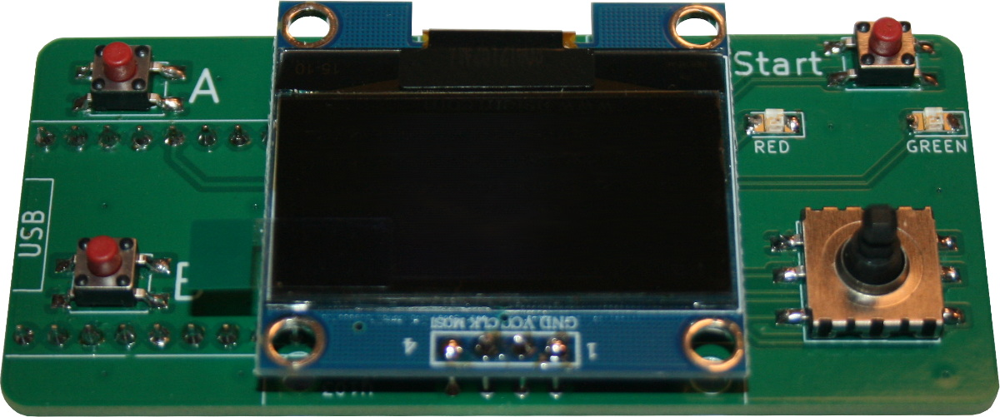
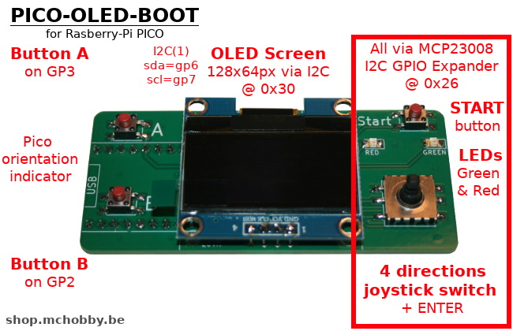
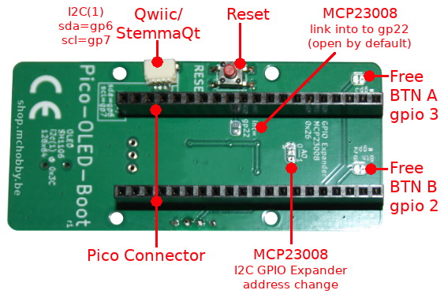
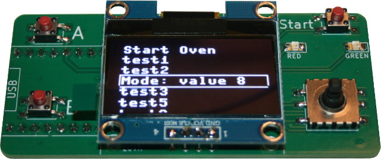
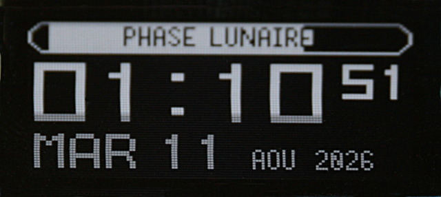
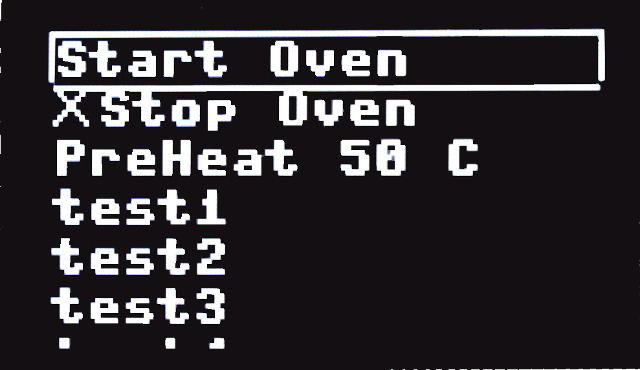
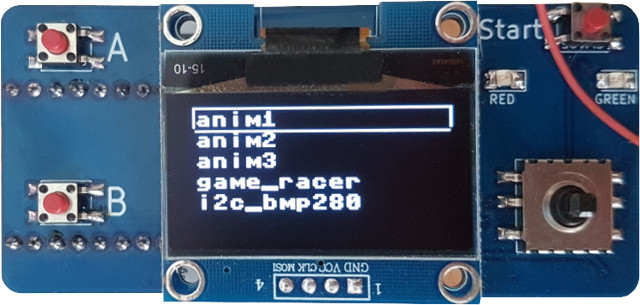
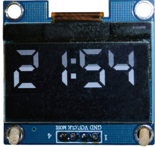
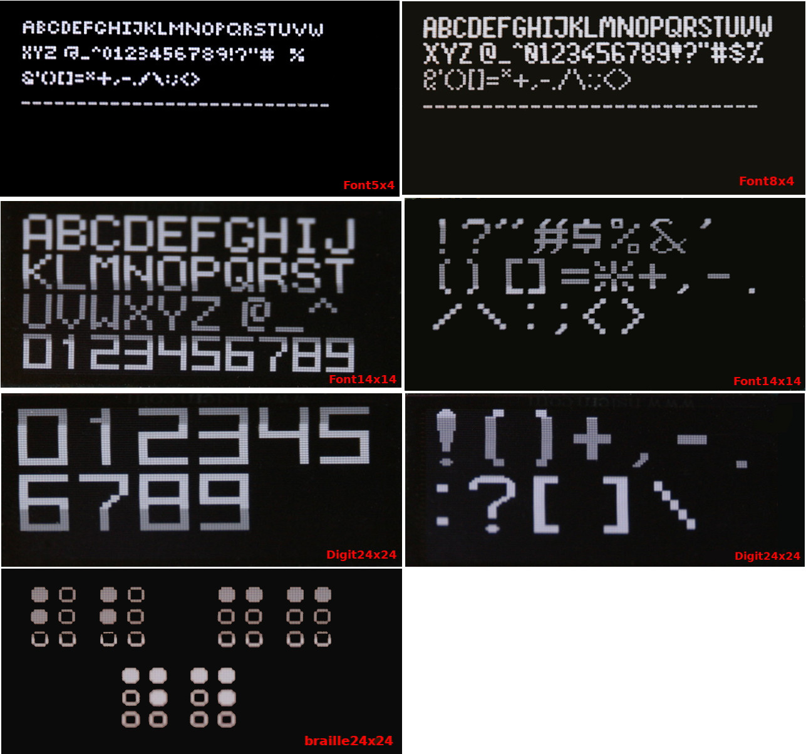

[This file also exist in English](readme_ENG.md)

# PICO-OLED-BOOT : un contrôleur graphique tout-en-un pour Pico (MicroPython compatible)

Le PICO-OLED-Boot est un complément intéressant pour ajouter une interface graphique (OLED, 128x64px) et des contrôles utilisateurs (joystick switc, buttons) à sur votre projet. 

Deux LEDs sont également disponibles pour offrir des notifications utilisateurs complémentaires.



Le Pico-Oled-Boot exposeégalement un connecteur Qwiic/StemmaQt et un bouton Reset sous la carte de sorte à rester rapidement et facilement accessible.

Grâce au MCP23008 (GPIO expander), le Pico-Oled-Boot peut être contrôlé à l'aide de 4 broches. Deux broches sont utilisées pour le bus I2C (gp6/gp7). Les deux autres broches (gp2/gp3) sont utilisées pour les boutons A & B permettant ainsi d'utiliser les interruptions.

Cette architecture laisse de nombreux entrées/sorties et bus disponibles pour votre propre projet.





Côté logiciel, vous disposez de tous les bibliothèques MicroPython nécessaires, ainsi qu'une bibliothèque __menuboot__ complémentaire permettant __d'implementer rapidement un MENU__ avec ce produit.



# Liste d'achat

* [Pico-Oled-Boot](https://shop.mchobby.be/fr/nouveaute/2914-pico-oled-boot-interface-oled-joystick-bouton-pour-raspberry-pi-pico-3232100029149.html) est disponible chez MCHobby


# Schéma

Le [schéma est également disponible ici](docs/_static/pico-oled-boot-schematic.jpg)

# Bibliothèque

La bibliothèque doit être copiée sur votre carte MicroPython MicroPython avant de pouvoir exécuter les exemples.

Bibliothèque absolument nécessaires:

* __oledboot__ : HELPER facilitant l'accàs aux fonctionnalités de Pico-Oled-Boot.
* __menuboot__ : affichage et gestion de MENU.
* __olededit__ : saisie de données.
* __sh1106__ : gestion de l'OLED.
* __mcp230xx__ : lecture du joystick

Celle-cis sont installée avec le package [pico-oled-boot/package.json](package.json) .

## Installation Masters

Le répertoire [masters.out/](masters.out) contient des archives reprenant les exemples et les bibliothèques nécessaires... tout est là!

Il suffit de copier le contenu de l'archive sur votre carte MicroPython en respectant la structure du système de fichiers présent dans l'archive.

## Installer avec MPRemote

Sur une plateforme WiFi:

```
>>> import mip
>>> mip.install("github:mchobby/pico-oled-boot")
```

Ou via l'utilitaire mpremote :

```
mpremote mip install github:mchobby/pico-oled-boot
```

# Brancher

Insérer votre carte Pico sur le connecteur femelle présent à l'arrière de votre carte. La présence du libellé __USB__ sur le Pico-Oled-Boot permet d'orienter le Pico (son connecteur USB doit être orienté dans la même direction)

# Exemples 
Le dépôt contient divers exemples pour faciliter la prise en main:

* __[test.py](examples/test.py)__ : script de test utilisé pour vérifier le fonctionnement de la carte (A/B/Start, Joystick, LEDs et OLED)
* __[jeux](examples/games/)__ : nombreux jeux pour votre Pico-Oled-Boot<br />
* __[roboeyes (exemples)](examples/roboeyes/)__ : utiliser la bibliothèque RoboEyes avec le Pico-Oled-Boot<br />
* __[animation (exemples)](examples/anim/)__ : des animations peuvent être affichées sur le Pico-Oled-Boot.
* __[clock (exemples)](examples/clock/)__ : divers exemples d'horloges exploitant l'affichage du Pico-Oled-Boot.<br />
* __[capteurs i2c (exemples)](examples/i2c/)__ : Divers exemples affichant des données en provenance de capteurs I2C connectés sur le connecteur qwiic/stemmaQt<br />
* __[fonts (exemples)](examples/fonts/)__ : Divers exemples démontrant l'utilisation d'autres Fonts avec votre Pico-Oled-Boot.
*  __[menu (exemples)](examples/menu/)__ : Scripts d'exemples démontrant les fonctionnalités du menu<br />
*  __[input (exemples)](examples/input/)__ : Différents exemples d'écran de saisie<br />
* __[bootloader](examples/booloader/)__ : bootloader avec autorun et menu de sélection du script a démarrer. Presser A pour forcer le menu. Presser B pour annuler l'autorun (vers REPL)<br />[Voir comment cela marche!](examples/bootloader/docs/autorun-howto.jpg)<br />

# Tester

## Direction du joystick
Le script suivant permet de détecter l'orientation du joystick, son bouton Enter et la bouton Start. Ces informations sont affichées sur l'écran OLED.

```
from oledboot import *
import time
import micropython
micropython.alloc_emergency_exception_buf(100)

# Right=Droite, Left=Gauche, Up=Haut, Down=Bas
labels = {START:"Start", ENTER:"Enter", UP:"Up", DOWN:"Down", LEFT:"Left", RIGHT:"Right"}
lcd = OledBoot()
# Initialiser l'écran
lcd.fill(0)
lcd.show()

while True:
	lcd.fill(0) # Effacer
	_d = lcd.dir # obtenir la direction
	if _d in labels:
		lcd.text( labels[_d],0,0,1 ) # Texte,x,y,couleur
	elif _d > 0: # 0=pas de direction
		lcd.text( str(_d), 0,0, 1 )
	lcd.show()
	time.sleep_ms( 100 )
```

Note: `dir` retourne 0 lorsque rien est détecté. Lors d'une combinaison de boutons (UP + Start) est détectée, leurs constantes sont sommées. Dans pareil cas, le script affiche une valeur numérique (à la place d'une combinaison de libellés).

Remarques: 

1. La détection précise peut également être effectuée avec une expression similaire à `(dir and RETURN)== RETURN`
2. Chaque accès à la propriété `dir` provoque un transfert sur le bus I2C. La bonne pratique consiste à copier la valeur retournée par `dir` dans une variable locale.

## Lecture des boutons A & B

Etant donné que les boutons sont des object de type `Pin`, les valeurs peuvent être obtenues à l'aide d'expression similaire a `OledBoot.a.value()`. La classe `Pin` permet d'attacher une routine d'interruption sur le bouton.

L'exemple ci-dessous attache une routine d'interruption (IRQ) sur les boutons A & B. Ces routines change l'état des LEDs utilisateurs rouge (Red) et verte (Green) à chaque pression du bouton correspondant.

```
from oledboot import *
import time
import micropython
micropython.alloc_emergency_exception_buf(100)

lcd = OledBoot()

# Utiliser les boutons A & B avec IRQ
last_a = time.ticks_ms()
def a_pressed( pin ):
	global lcd, last_a
	# évite 2 activations consécutives sur 100ms
	if time.ticks_diff( time.ticks_ms(), last_a ) > 100:
		lcd.red.value( not(lcd.red.value()) )
		last_a = time.ticks_ms()

last_b = time.ticks_ms()
def b_pressed( pin ):
	global lcd, last_b
	if time.ticks_diff( time.ticks_ms(), last_b ) > 100:
		lcd.green.value( not(lcd.green.value()) )
		last_b = time.ticks_ms()

lcd.a.irq( handler=a_pressed, trigger=Pin.IRQ_RISING )
lcd.b.irq( handler=b_pressed, trigger=Pin.IRQ_RISING )
``` 

## Affichage du menu

The Pico-Oled-Boot feature a reusable menu. User scripts can also displays their own menu.


The 
Voir la description de la bibliothèque OledMenu ci-dessous (et les fichiers d'exemples).


## Saisie de données

Le script ci-dessous permet de saisir des données avec la classe __EditScreen__. Le script est disponible dans les exemples sous le nom [examples/test_input_screen.py](examples/test_input_screen.py) .


Pour la validation de données et saisir numérique, voir les exemples [test_input_keypress.py](examples/test_input_keypress.py) et [test_input_validate.py](examples/test_input_validate.py)

``` python 
from oledboot import *
from olededit import EditScreen

oled = OledBoot()
print( "Showing Input Screen..." )
scr = EditScreen( oled, 'Name:', 'David' )
if scr.show():
    oled.fill(0)
    oled.text( scr.value, 1, 0 )
    oled.show()
else:
    oled.fill(0)
    oled.text( "Cancelled!", 1, 0 )
    oled.show()
print( "That s all folks!" )
```


# Bibliothèque OledBoot

La bibliothèque est documentée dans le document [doc-oledboot.md](doc-oledboot.md)

# Bibliothèque MenuBoot 

La bibliothèque est documentée dans le document [doc-menuboot.md](doc-menuboot.md).

Le bibliothèque s'accompagne également d'exemples dans [examples/menu/](examples/menu/).

# Bibliothèque OledEdit

La bibliothèque est documentée dans le document [doc-menuboot.md](doc-menuboot.md).

Le bibliothèque s'accompagne également d'exemples dans [examples/input/](examples/input/).

# Bibliothèque FBGFX
Installé avec la bibliothèque OledBoot, la bibliothèque FBGFX permet d'ajouter des fonctions de dessin supplémentaire au FrameBuffer (primitives graphiques complémentaires). Cette bibliothèque dispose également d'une bibliothèque d'icones 5x5 et 8x8 pixels.




## Fonts
Pour le rendu des Fonts alternatives, voyez les exemples dans [examples/fonts/](examples/fonts/) .



La bibliothèque et sa documentation sont disponibles sur [esp8266-upy/FBGFX](https://github.com/mchobby/esp8266-upy/tree/master/FBGFX)

# Bibliothèque RoboEyes
RoboEyes utilise un FrameBuffer pour dessiner et animer des yeux sur un écran.

Roboyes pour Pico-Oled-Boot dispose de scripts d'exemples dans [examples/roboeyes/](examples/roboyeyes/) .


La bibliothèque et sa documentation sont disponibles sur [micropython-roboeyes](https://github.com/mchobby/micropython-roboeyes)

# Autres bibliothèques utiles

* [FileFormat](https://github.com/mchobby/esp8266-upy/tree/master/FILEFORMAT) : lecture de fichiers images.
* [COLORS](https://github.com/mchobby/esp8266-upy/tree/master/COLORS) : manipulation de couleurs
* [nano-gui](https://github.com/peterhinch/micropython-nano-gui/tree/master) : GUI MicroPython minimalistique par Peter-Hinch


