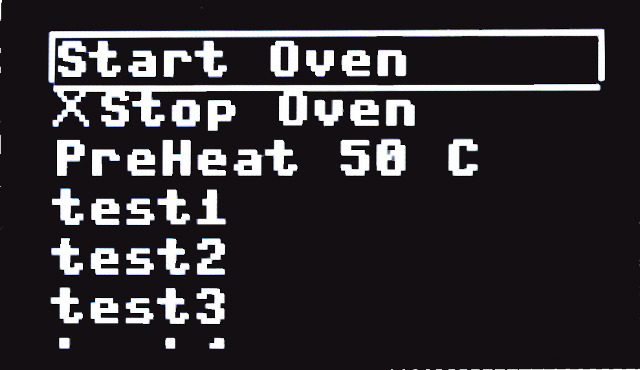
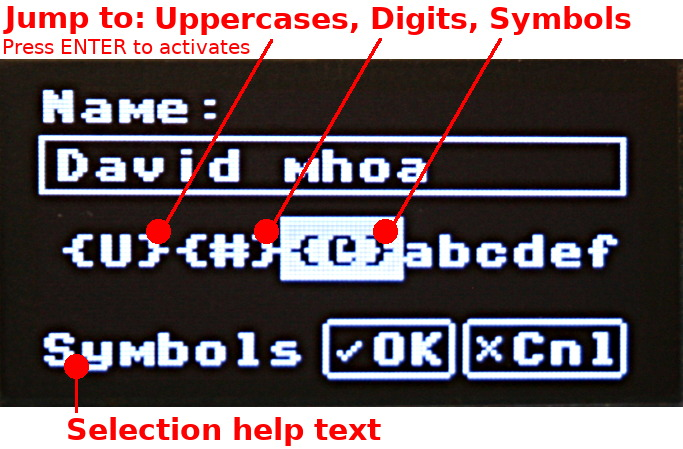
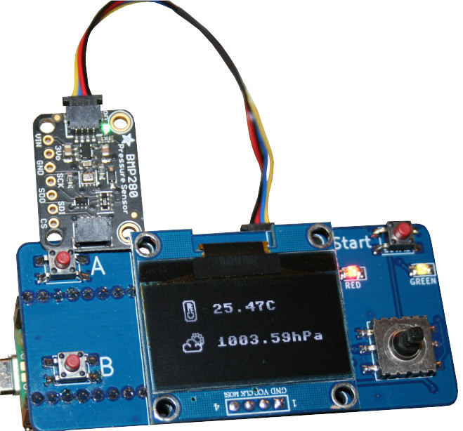
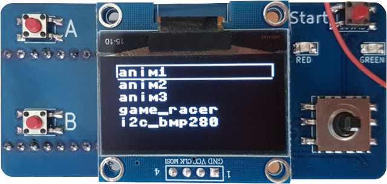
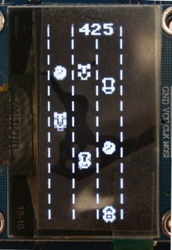
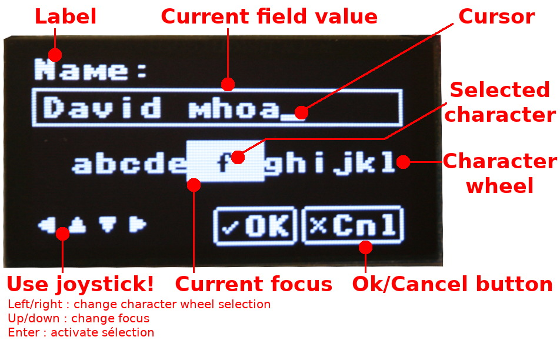
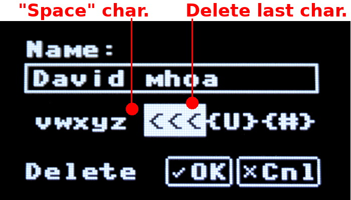
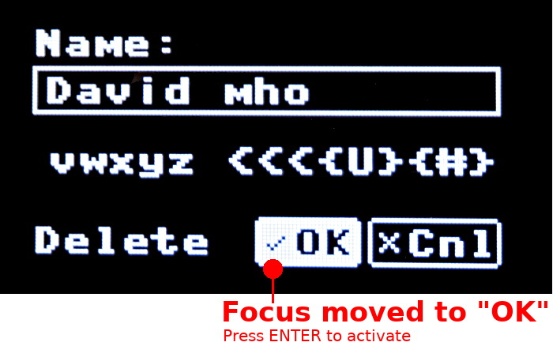
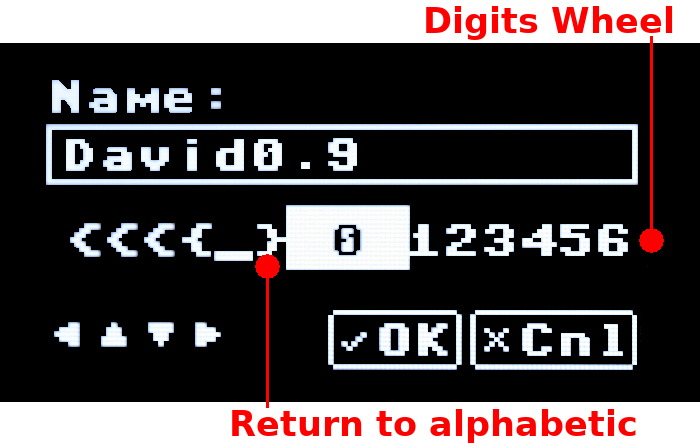

[Ce fichier existe également en Français](readme.md)

# PICO-OLED-BOOT : all-in-one graphical controler for Pico (MicroPython compatible)

The PICO-OLED-Boot is a convenient tool to add a graphical display (OLED, 128x64px) together with controlers interfaces made of a joystick switch and buttons. 

Two LEDs are also available and can be used as user notification.


It also feature a Qwiic/StemmaQt connector and a reset button under the board for a quick and easy access. 

Thank to the GPIO expander, the full board can be controled with 4 pins. Two are used for I2C bus (gp6/gp7). The two other pins (gp2/gp3) are used for the buttons A & B in order allowing IRQ binding.

That leaves lots of remaining IO and buses for your own project.


Software side includes everything you need to run it with MicroPython, an extra __menuboot__ library is available to __quickly implements menu__ with the product.


# Schematic

The [schematic is also available here](docs/_static/pico-oled-boot-schematic.jpg)

# Library

The libraries must be copied on the MicroPython board before using the examples.

Absolute required libraries are:

* __oledboot__ : HELPER for using the board features.
* __menuboot__ : MENU drawing and handling.
* __olededit__ : data encoding screen.
* __sh1106__ : required for OLED screen
* __mcp230xx__ : required for joystick read

Those are installed with the package [pico-oled-boot/package.json](package.json) .

## Install with MPRemote

On a WiFi capable plateform:

```
>>> import mip
>>> mip.install("github:mchobby/pico-oled-boot")
```

Or via the mpremote utility :

```
mpremote mip install github:mchobby/pico-oled-boot
```

## Manual install

You can check the [package.json](package.json) file to locate the various libraries then copy the required files to your micropython board.

# Wire

Just plug your Pico onto the female header available on the back of the board. The board shows a __USB__ label on the silkscreen to indicates the orientation of the Pico (its USB connector must be oriented the same way)

# Exemples 
The repository contains various examples script as first hand helper:

* __[test.py](examples/test.py)__ : test script used to check the board features (A/B/Start, Joystick, LEDs & OLED)
*  __[test_menu_basic.py](examples/test_menu_basic.py)__ : test the main features of the menu.<br />
*  __[test_menu_combo.py](examples/test_menu_combo.py)__ : test the combo feature (selection list) for a menu entry.
*  __[test_menu_range.py](examples/test_menu_range.py)__ : test the range value selection of the menu (ex: changing a numeric value).
*  __[test_menu_screen.py](examples/test_menu_screen.py)__ : test the screen/dashboard display on menu entry activation.
* __[test_input_screen.py](examples/test_input_screen.py)__ : Display an edit field to encode data<br />
* __[test_input_keypress.py](examples/test_input_keypress.py)__ : Character validation before adding it to the encoded value.
* __[test_input_validate.py](examples/test_input_validate.py)__ : Validate tje `value` when the OK button is activated. 
* __[test_i2c_bmp280.py](examples/test_i2c_bmp280.py)__ : connect a BMP280/BME280 sensor on the Qwiic/StemmaQT, read the data then display it on the screen (with icon).<br />
* __[bootloader](examples/booloader/)__ : bootloader with autorun and selection menu  for starting script. Pres A to force menu display. Press B to skip autorun (go to REPL)<br />[See how it works!](examples/bootloader/docs/autorun-howto.jpg)<br />
* __[games/racer/racer.py](examples/games/racer/racer.py)__ : jeu de course<br />

# Test

## Reading directions
The following script reads the joystick switch and Start button then displays it corresponding text label on the OLED.

```
from oledboot import *
import time
import micropython
micropython.alloc_emergency_exception_buf(100)

labels = {START:"Start", ENTER:"Enter", UP:"Up", DOWN:"Down", LEFT:"Left", RIGHT:"Right"}
lcd = OledBoot()
# Initialize screen
lcd.fill(0)
lcd.show()

while True:
	lcd.fill(0) # Clear
	_d = lcd.dir # Get direction
	if _d in labels:
		lcd.text( labels[_d],0,0,1 ) # Text,x,y,color
	elif _d > 0: # 0=No direction
		lcd.text( str(_d), 0,0, 1 )
	lcd.show()
	time.sleep_ms( 100 )
```

Note: `dir` returns 0 when nothing is detected. When a combination of buttons (UP + Start) is detected then their constants are summed together. In this case, the numeric value is displayed instead of labels combinations.

Remarks: 

1. a proper detection can be made with expression like `(dir and RETURN)== RETURN`
2. each access to `dir` property issues a communication over the I2C bus. A better approach is to copy the `dir`  result in the local variable.

## Reading A & B buttons

As buttons are `Pin` instances, the values can be read with a `OledBoot.a.value()`. The advantages of the `Pin` is to attach a interrupt handler routine.

The following example attach IRQ routine to the buttons A & B then changes the user LED state each time the button is pressed.

```
from oledboot import *
import time
import micropython
micropython.alloc_emergency_exception_buf(100)

lcd = OledBoot()

# Using button A & B with IEQ
last_a = time.ticks_ms()
def a_pressed( pin ):
	global lcd, last_a
	# avoids two consecutive changes within 100ms
	if time.ticks_diff( time.ticks_ms(), last_a ) > 100:
		lcd.red.value( not(lcd.red.value()) )
		last_a = time.ticks_ms()

last_b = time.ticks_ms()
def b_pressed( pin ):
	global lcd, last_b
	if time.ticks_diff( time.ticks_ms(), last_b ) > 100:
		lcd.green.value( not(lcd.green.value()) )
		last_b = time.ticks_ms()

lcd.a.irq( handler=a_pressed, trigger=Pin.IRQ_RISING )
lcd.b.irq( handler=b_pressed, trigger=Pin.IRQ_RISING )
``` 

## Menu display

See below the OledMenu library description (and file examples).

## User data acquisition

The code below is used to capture data with the __EditScreen__ class. The example script is available under the file [examples/test_input_screen.py](examples/test_input_screen.py) .



See the following examples for data validation and numeric acquisition : [test_input_keypress.py](examples/test_input_keypress.py) and [test_input_validate.py](examples/test_input_validate.py)

``` python 
from oledboot import *
from olededit import EditScreen

oled = OledBoot()
print( "Showing Input Screen..." )
scr = EditScreen( oled, 'Name:', 'David' )
if scr.show():
    oled.fill(0)
    oled.text( scr.value, 1, 0 )
    oled.show()
else:
    oled.fill(0)
    oled.text( "Cancelled!", 1, 0 )
    oled.show()
print( "That s all folks!" )
```

# OledBoot library

The [oledboot.py](lib/oledboot.py) file contains the __OledBoot__ class as well as the required constant definition.

Only the essential definitions are listed below.

## Constants

The following constant are used to identify the direction of the joystick. The constants also cover the "Start" button as well as the "Enter" key (when joystick is pressed down).

```
DOWN = const(1)
UP   = const(8)
RIGHT= const(4)
LEFT = const(16)
ENTER= const(2)
START= const(32)
```

Note that going up while pressing the joystick will returnns the value ENNTER+UP (so 10). The value 0 will be returned when no direction is selected.

## OledBoot class

The __OledBoot__ class will offer a quick access to screen, input and outputs. The class takes care of allocating the required ressources.

The __OledBoot__ inherits from [MicroPython FrameBuffer](https://docs.micropython.org/en/latest/library/framebuf.html) so you can call all known drawing primitives (see [documentation here](https://docs.micropython.org/en/latest/library/framebuf.html))

Remark:

The FBGFX library (also installed with MPRemote) can be used to expand the capabilities of the FrameBuffer. Check the [FBGFX documentation here](https://github.com/mchobby/esp8266-upy/tree/master/FBGFX))

### Constructor

``` 
def __init__( self, oled_addr=0x3c, mcp_addr=0x26 )
```

* __oled_addr__ : I2C address of the OLED screen. This can be change to an alternative address on the back of the display. In such case, indicates the new address in this parameter.
* __mcp_addr__ : I2C address of the GPIO expander. That address can be changed in the back of the PCB on a 3 points solder jumper (cut the current trace and solder the opposite one to the center pole ). Indicates the new I2C address here when changed.

### member i2c : I2C

Provide access to the I2C bus shared between the OLED screen, GPIO expander and Qwiic port.

This reference will be useful when connecting extra device on the Qwiic port.

### members a: Pin , b: Pin

Gives access to the A or B buttons. As they are instances of Pin class, user code can access the `value()` method or attach an IRQ handler.

Reading the value return `False` when the button is pressed and `True` when released.

### Members red: LedAdapter, green: LedAdapter

Gives access to the "green" and "red" leds above the joystick.

The LedAdapter class offers the methods `value()`, `on()` and `off()` allowing to control the LEDs as simple `Pin` class.

### Member dir: int

Check the current state of the joystick (and Start button) then returns one of the constants DOWN, UP, RIGHT, LEFT, ENTER, START otherwise 0.

Note that several action can be combined like RIGHT+START or LEFT+START+ENTER. In such case, the innvolved constant value are sum.

## LedAdapter class

The __LedAdapter__ class is designed to control the both LED on the GPIO expander (MCP23008) as it was simple Pin class. So the class expose the methodes:

* __on()__ : activates the LED
* __off()__ : deactivates the LED
* __value()__ : use the boolean parameter to set/unset the LED state. Without parameter, it returns the last known value.

# MenuBoot library

The [menuboot.py](lib/menuboot.py) file contains the __MenuBoot__ class used to draw, manage and detect selected menu entry with the OLED screen.

MenuBoot allows to:

* draw __basic MenuItem__ with code-label (that can be enabled/disabled)
* draw __range MenuItem__ (to select a numeric value within a range)
* draw __combo MenuItem__ (to select a value from a pre-defined key-value list)
* draw __custom MenuItem__ (used to customise action on menuitem)

The __basic MenuItem__ relies on the user code to implement the expected action whereas the __range, combo, custom MenuItem__ are completely autonomous actions not requiring any user code for them to work properly (notice that custom MenuItem allows to bind customized functions to MenuItem).

## MenuBoot class
A menu is constructed with the `MenuBoot` class. The code here below shows how to create the menu entries. The key methods are: `add_label()` , `start()` and `update()`. The menu item selected can be read with the `selected` property.


The following code snipped show how to:

1. create a menu, 
2. display it (use UP and DOWN to move the selection) 
3. get informed when an entry is selected with ENTER.

See the [test_menu_basic.py](examples/test_menu_basic.py) for more details.

``` 
from oledboot import *
from menuboot import *

lcd = OledBoot()
menu = MenuBoot( lcd )

menu.add_label( "start", "Start Oven" ) # code, Label
menu.add_label( "stop" , "Stop Oven" , enabled=False )
menu.add_range( "preheat" , "PreHeat %s C", 25, 180, 5, 50 ) # Min, Max, Step, default
menu.add_label( "t1", "test1" ) 
menu.add_label( "t2", "test2" ) 
menu.add_label( "t3", "test3" ) 
menu.add_label( "t4", "test4" ) 
menu.add_label( "t5", "test5" ) 
menu.add_label( "t6", "test6" ) 
menu.add_label( "t7", "test7" ) 
menu.add_label( "t8", "test8" ) 

menu.start()
while True:
        if menu.update(): # True when entry selected
                entry = menu.selected # will reset selection
                if entry:
                        print( "%s selected" % entry )

                        if entry.code=="start":
                                menu.by_code("stop").enabled=True
                        elif entry.code=="stop":
                                menu.by_code("stop").enabled=False
        # Process other tasks here
```

Only the main entries are described here below.

### Constructor 

``` 
def __init__( self, oled_boot )
```

Menu constructor, takes the OledBoot class (the OLED screen) as reference.

### Member add_label()
Add a LABEL menu item in the menu. 

Such entry must be handled by the user script to execute the target action.

```
def add_label( self, code, label, enabled=True ):
```

* __code__ : unique identifier of the MenuItem.
* __label__ : static label displayed in the menu. 


### Member add_range()

Add a RANGE menu item in the menu.


```
def add_range( self, code, label, min_val, max_val, step, default_val, enabled=True ):
```

* __code__ : unique identifier of the MenuItem.
* __label__ : dynamic label displayed in the menu and range selector screen. The __required "%s" is substitued__ with the current value of the range.
* __min_val__ : minimum value of the range.
* __max_val__ : maximum value of the range.
* __step__ : increment/decrement of the value in the range selector.
* __default_val__ : the value to shows when the range selector is displayed.
* __enabled__ : when False, the menu entry cannot be selected (and show a X in front).

Such entry is handled by the menu to allow the user to select a numeric value inside a possible range. The user code __is notified after__ the new value is applied.

The selected value can be retreived from the __MenuItem__ class as follows:

```
value = my_menu.by_code("menuitem_code").cargo.value
```

As the `my_menu.selected` property also returns a __MenuItem__, the `value` can also be readed from it as follow:

```
entry = menu.selected
...
if (entry!=None) and (entry.code=="the_range_menuitem_code"):
  value = entry.cargo.value
```

See also the [test_menu_range.py](examples/test_menu_range.py) example script for more details.

### Member add_combo()

Add a COMBO based menu item in the menu.


Such entry is handled by the menu to allow the user to select a value from a list. The user code __is notified after__ the new value is applied.

```
def add_combo( self, code, label, entries, default, enabled=True ):
```

* __code__ : unique identifier of the MenuItem.
* __label__ : dynamic label displayed in the menu. The __required "%s" is substitued__ with the selected label.
* __entries__ : List of (key,label) entries displayed in the combo selector screen.
* __default__ : the initial key to select when the combo selector is show.
* __enabled__ : when False, the menu entry cannot be selected (and show a X in front).

The selected value can be retreived from the __MenuItem__ class as follows:

```
value = my_menu.by_code("menuitem_code").value
label = my_menu.by_code("menuitem_code").label
```

The script [test_menu_combo.py](examples/test_menu_combo.py) show how to encode a COMBO into the menu

```
from oledboot import OledBoot
from menuboot import MenuBoot

lcd = OledBoot()
menu = MenuBoot( lcd )

menu.add_label( "start", "Start Oven" ) # code, Label
menu.add_label( "t1", "test1" ) 
menu.add_label( "t2", "test2" ) 
# Parameter are: Menu-code, Menu-label, List of Key-Label, Selected-Key
menu.add_combo( "combo4", 
                "Mode: %s", 
                [("v1", "value 1"),("v2", "value 2"),("v3", "value 3"),("v4", "value 4"),("v5", "value 5"),("v6", "value 6"),("v7", "value 7"),("v8", "value 8")], 
                "v8" ) 
menu.add_label( "t3", "test3" ) 
menu.add_label( "t5", "test5" ) 
menu.add_label( "t6", "test6" ) 
menu.add_label( "t7", "test7" ) 
menu.add_label( "t8", "test8" ) 

menu.start()

while True:
  if menu.update(): # true when entry selected
    entry = menu.selected # will reset selection
      if entry:
        print( "%s selected" % entry )
        # We are informed when we leave the Combo sub-menu
        if entry and entry.code=="combo4":
          print( "Combo selection is '%s' " % menu.by_code("combo4").cargo.value )
          print( "  +-> with label '%s'" % menu.by_code("combo4").cargo.label )
  # Process other tasks here
```

When the script is executed, the following results is displayed within the REPL session.

```
<combo4 "Mode: v5"> selected
Combo selection is 'v5'
  +-> with label 'value 5'
```

### Member add_screen()

Add a custom SCREEN menu item. When the entry is selected, it calls a `on_start()` function then continuously calls a `on_draw()` function until the ENTER key is pressed.

As for Range and Combo menu item, the user script is notified when the SCREEN is closed.

This feature is used to show custom display content or custom configuration content.

```
def add_screen( self, code, label, on_draw, on_start=None, enabled=True ):
```

* __code__ : unique identifier of the MenuItem.
* __label__ : static label displayed in the menu.
* __on_draw__ : the event( screen_controler ) is called before calling the on_draw event. This is the right location to initialse some variable.
* __on_draw__ : the event( screen_controler, oled ) called to refresh the screen content. This function is continuously called until the screen_controler detects the ENTER key.
* __enabled__ : when False, the menu entry cannot be selected (and show a X in front).

See the [test_menu_screen.py](examples/test_menu_screen.py) example script for implementation details.

### Member start()

Prepare the object instance to display the menu. The call of `start()` must be followed by continuous call to `update()` method.

```
def start( self ):
```

### Member update(): bool

The `update()` manage the display an the interaction within the menu.

```
def update( self ):
```

The `update()` method must be call as long as the menu must be displayed by the user script.

The method return `True` to inform the user script of a selection in the menu.

The selected item can be identified via the `selected` property.

__When basic menu item is selected:__ 

Like menu item added by `add_label` THEN the user script is directly notified of the selection. 

__When a menu item is managed by a menu controler:__ 

Like Range, Combo, Screen controler THEN the execution is transfered to the controler. The controler takes control of the OLED screen to perform the configuration task. 

The user script is informed of the selection only when the controler exits back to the menu.

When selected item have a dedicated controler => it is called by the menu!

### Property selected: MenuItem

Return reference to the selected MenuItem. The selected reference is clear as soon as been read (this avoids multiple detection of a selected menu item).

```
 @property
 def selected( self ):
```

Notice that MenuItem associated to controler like Range, Combo, Screen, ect offers an access to the target controler via the `MenuItem.cargo` attribute. This is where additionnal information can be retreived.

### member by_code(): MenuItem

Retreives the reference to the Menu Item definition object.


```
def by_code( self, code ):
```

## MenuItem class

The MenuItem class contains definition information about a menu entry.

The main properties it offers are the following:

* __owner__ : the owner is the MenuBoot instance.
* __code__ : string acting as unique identification of the menu entry.
* __label__ : label displayed inside the menu.
* __enabled__ : True/False, a disabled menu item stays visible but cannot gets the focus (aka selection frame).
* __visible__ : True/False, the menu items appears or not when the menu is displayed.
* __cargo__ : None or reference to a Controler when it applies (like Range, Combo, Screen, etc)
* __focus__ : _Property_ indicating when the menu item should displays the focus frame around it. 
* __selected__ : _Property_ indicating when the menu item has been selected by the user.

The main methods are the following:
* __draw()__ : display the menu item at a given position into the Oled.

## RangeControler, ComboControler, ScreenControler

Those classes manage the specific behaviour of advanced menu item. 

Instance of such classes are stored within the `MenuItem.cargo` and expose specific property related to the target behaviour.

The main properties are the following:

* __owner__ : the MenuBoot instance.
* __parent__ : the parent MenuItem object.
* Each controler also implements its specific members.

The main methods (common to all controler) are the following:

* __start()__ : initialise the internal state of the controler. It is followed by continuous call to `update()` .
* __update()__ : continuously called until the user press ENTER key. This method is in charge of the drawing the Oled and respond to user interaction.

# OledEdit library

The [olededit.py](lib/olededit.py) script contains the __EditScreen__ class used to key-in alphanumeric user data with the Pico-Oled-Boot joystick.

The field editor encoding is kindly intuitive, the joystick is used to select the charactersLe (left/right), move the focus (up/down) and to confirm selection  (press). Note that using UP direction with the character whell do jump several letters at once.








## Constants
The `STATE_xxx` constants are used to select the initial characters wheel at startup.
``` python
STATE_NORMAL = const(0) # Display normal char
STATE_SHIFTED= const(1) # Display Uppercase Char
STATE_DIGIT  = const(2) # Display Digit + Decimal_Separator
STATE_SYMBOL = const(3) # Displat @, #, (, ...
```

## EditScreen class

The __EditScreen__ class drives the display while capturing user data then returns to the callee when the data is comfirmed by the user.


### Constructor

```
def __init__( self, oled_boot, label, initial_value='', on_key_press=None, on_validate=None, initial_state=STATE_NORMAL )
```

* __oled_boot__ : reference to the __OledBoot__ object (that herits from  __FrameBuffer__) giving access to the OLED display and various user input interface.
* __label__ : text displayed above the edit field.
* __initial_value__ : (optional) initial string value displayed into the edit field.
* __on_key_press__ : (optional) used to attach a callback event called just before its addition to the edit field. Can be used to reject selection when returning False. <br />Event(Owner,Key) where `owner` is the EditScreen instance and `key` the ASCII code of the added char.
* __on_validate__ : (optional) used to attach a callback event called before accepting the OK button. It is used to validate the input by returning True/False. The __ValueError__ exception are also captured and their message shown on the display for a second.<br />Event(value) where `value` contains the captured value.
* __initial_state__ : (optional, STATE_xxx constants) initial state of the character wheel. Allow the selection of an alternate wheel (like digits).

### Member value : string

Value captured by the user.

### Method show() : boolean

``` 
def show( self ):
```

Start data capture and return True/False depending on OK/Cancel user confirmation.

The captured value is available via the `value` attribute.

# FBGFX library
Installed with the OledBoot library, the FBGFX library offers FrameBuffer based manipulation utilities as well as icons Library


The library and its documentation are available on [esp8266-upy/FBGFX](https://github.com/mchobby/esp8266-upy/tree/master/FBGFX)

# RoboEyes Library
RoboEyes do use the FrameBuffer to draw and animate ayes on a display.

The RoboEyes library for MicroPython is a portage of C library initialy made for Arduino.


The library and its documentation are available on [micropython-roboeyes](https://github.com/mchobby/micropython-roboeyes)

# Other useful libraries

* [micropython-roboeyes](https://github.com/mchobby/micropython-roboeyes) : library draws smoothly animated robot eyes on OLED displays.
* [Small-Font](https://github.com/mchobby/esp8266-upy/tree/master/SMALL-FONT) a smaller font for MicroPython
* [FileFormat](https://github.com/mchobby/esp8266-upy/tree/master/FILEFORMAT) : to read image files.
* [COLORS](https://github.com/mchobby/esp8266-upy/tree/master/COLORS) : color manipulation utilities
* [ano-gui](https://github.com/peterhinch/micropython-nano-gui/tree/master) : a lightweight and minimal MicroPython GUI library from Peter-Hinch

# Shopping list

* [Pico-Oled-Boot](https://shop.mchobby.be/fr/nouveaute/2914-pico-oled-boot-interface-oled-joystick-bouton-pour-raspberry-pi-pico-3232100029149.html) is available at MCHobby
